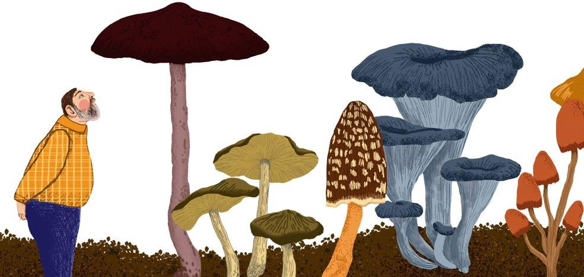
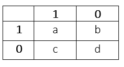

```{r setup, include=FALSE}
knitr::opts_chunk$set(echo = TRUE)
```

# MEMORIA

```{r portada,echo=FALSE}

```

#  Introducción

Este conjunto de datos incluye descripciones de muestras hipotéticas basándose en características de hongos de la familia Agaricus y Lepiota.

Para visualizar mejor nuestros análisis necesitamos cargar las siguientes librerías:
```{r librerias,echo=TRUE,warning=FALSE,error=FALSE,message=FALSE}
library(ggplot2)
library(psych)
library(philentropy)
library(kmed)
library(vegan)
library(class)
library(cluster)
library(rpart)
library(rpart.plot)
library(e1071)
library(randomForest)
```

# Objetivos

Nuestro objetivo será identificar la toxicidad de cada seta basándonos en las distintas características recogidas.


#  Datos 

Importamos los datos mediante el siguiente comando:
```{r introduccion datos,echo=TRUE}
datos.setas<-read.table("agaricus-lepiota.data",header=FALSE,sep=",")
```

Comprobamos que se han leído correctamente los datos mirando la dimensión de los datos.
```{r dimension,echo=TRUE}
dim(datos.setas)
```

Como vemos, disponemos de 8124 observaciones de setas de las cuales hemos recogido información sobre 23 características.

Realizamos una exploración básica de los datos para comprobar que tipo de datos tenemos.
```{r tipo de variables, echo=TRUE}
summary(datos.setas)
```
Luego son variables cualitativas y por tanto habrá que tratarlas como factores. Estas variables son:


 NOMBRE VARIABLE | DESCRIPCIÓN
 --------------- | ------------
  Letalidad      | venenosa (p) o comestible(e)
  Forma del sombrero o píleo | campana (b), cónica (c), convexa (x), plana (f), nudosa (k) o hundida (s)
  Cutícula o superficie del sombrero | fibroso (f), con surcos (g), escamosa (y) o lisa (s)
  Color del sombrero | marrón (n), ante (b), canela (c), gris (g), verde (r), rosa (p), morado (u), rojo (e), blanco (w) o amarillo (y)
  Escamas | verdadero (t) o falso (f)
  Olor | almendra (a), anís (l), creosota (c), pescado (y), asqueroso (f), mohoso (m), ninguno (n), acre(p) o picante (s)
  Fijación de las láminas | adjunto (a), descendente (d), libre (f) o entallado (n)
  Espacio entre láminas | cerca (c), atestado (w) o distante (d)
  Tamaño de las láminas | ancho (b) o estrecho (n)
  Color de las láminas | negro (k), marrón (n), ante (b), chocolate (h), gris (g), verde (r), naranja (o), rosa (p), morado (u), rojo (e), blanco (w) o amarillo (y)
  Forma del tallo | agrandado (e) o afilado (t)
  Tallo-raíz | bulboso (b), club (c), copa (u), igual (e), rizomorfos (z), enraizado (r) o faltante (?)
  Superficie del tallo por encima del anillo | fibroso (f), escamoso (y), sedoso (k) o liso (s)
  Superficie del tallo por debajo del anillo | fibroso (f), escamoso (y), sedoso (k) o liso (s)
  Color del tallo por encima del anillo | marrón (n), ante (b), canela (c), gris (g), naranja (o), rosa (p), rojo (e), blanco (w) o amarillo (y)
  Color del tallo por debajo del anillo | marrón (n), ante (b), canela (c), gris (g), naranja (o), rosa (p), rojo (e), blanco (w) o amarillo (y)
  Tipo de volva | parcial (p) o universal (u)
  Color del volva | marrón (n), naranja (o), blanco (w) o amarillo (y)
  Número de anillos | ninguno (n), uno (o) o dos (t)
  Tipo de anillo | telaraña (c), evanescente (e), abocinado (f), grande (l), ninguno (n), colgante (p), revestimiento (s) o zona (z)
  Color de las esporas | negro (k), marrón (n), ante (b), chocolate (h), verde (r), naranja (o), morado (u), blanco (w) o amarillo (y)
  Población | abundante (a), agrupada (c), numerosa (n), dispersa (s), varias (v) o solitaria (y)
  Hábitat | pastos (g), hojas (l), prados (m), caminos (p), urbano (u), desechos (w) o bosques (d)

Vamos a llamar a las variables como la característica que ejemplifican.
```{r nombre de variables}
colnames(datos.setas)=c("Letalidad","Forma_S","Cuticula","Color_S","Escamas","Olor","Fijacion_L","Espacio_L","Tamaño_L","Color_L","Forma_T","Tallo_raiz","Superficie_T1","Superficie_T2","Color_T1","Color_T2","Tipo_V","Color_V","N_anillos","Tipo_anillo","Color_esporas","Poblacion","Habitat")
```


#  Preprocesado de datos.

Para poder transformar las variables en factores, lo hacemos aplicando el comando **as.factor()** a todas las variables.
```{r factores, echo=FALSE}
#VARIABLE RESPUESTA
datos.setas$Letalidad=as.factor(datos.setas$Letalidad)
#VARIABLE 1
datos.setas$Forma_S=as.factor(datos.setas$Forma_S)
#VARIABLE 2
datos.setas$Cuticula=as.factor(datos.setas$Cuticula)
#VARIABLE 3
datos.setas$Color_S=as.factor(datos.setas$Color_S)
#VARIABLE 4
datos.setas$Escamas=as.factor(datos.setas$Escamas)
#VARIABLE 5
datos.setas$Olor=as.factor(datos.setas$Olor)
#VARIABLE 6
datos.setas$Fijacion_L=as.factor(datos.setas$Fijacion_L)
#VARIABLE 7
datos.setas$Espacio_L=as.factor(datos.setas$Espacio_L)
#VARIABLE 8
datos.setas$Tamaño_L=as.factor(datos.setas$Tamaño_L)
#VARIABLE 9
datos.setas$Color_L=as.factor(datos.setas$Color_L)
#VARIABLE 10
datos.setas$Forma_T=as.factor(datos.setas$Forma_T)
#VARIABLE 11
datos.setas$Tallo_raiz=as.factor(datos.setas$Tallo_raiz)
#VARIABLE 12
datos.setas$Superficie_T1=as.factor(datos.setas$Superficie_T1)
#VARIABLE 13
datos.setas$Superficie_T2=as.factor(datos.setas$Superficie_T2)
#VARIABLE 14
datos.setas$Color_T1=as.factor(datos.setas$Color_T1)
#VARIABLE 15
datos.setas$Color_T2=as.factor(datos.setas$Color_T2)
#VARIABLE 16
datos.setas$Tipo_V=as.factor(datos.setas$Tipo_V)
#VARIABLE 17
datos.setas$Color_V=as.factor(datos.setas$Color_V)
#VARIABLE 18
datos.setas$N_anillos=as.factor(datos.setas$N_anillos)
#VARIABLE 19
datos.setas$Tipo_anillo=as.factor(datos.setas$Tipo_anillo)
#VARIABLE 20
datos.setas$Color_esporas=as.factor(datos.setas$Color_esporas)
#VARIABLE 21
datos.setas$Poblacion=as.factor(datos.setas$Poblacion)
#VARIABLE 22
datos.setas$Habitat=as.factor(datos.setas$Habitat)
```

Ahora podemos ver mejor como son nuestros datos.
```{r resumen datos,echo=TRUE}
summary(datos.setas)
```
Una de las variables, **Tipo_v** (tipo de volva) con dos niveles distintos, parcial (p) y universal (u), podríamos eliminarla de nuestros datos pues todo la frecuencia solo está en uno de los niveles, luego no aporta información alguna para determinar si es venenosa o comestible.

```{r eliminar variable,echo=TRUE}
datos.setas=datos.setas[,-17]
```

Quizás trabajar con este tipo de datos no sea lo más adecuado, por ello nos planteamos codificar las variables de forma que sean binarias, para ello cada subnivel de las variables originales se va a convertir en una nueva variables binaria, de forma que será 0 si no se presenta ese subnivel en la variable original y 1 si si lo hace.

En la variable respuesta, establecemos que 1 es si la seta es venenosa y 0 si no lo es. La variable **Escamas**, la codificamos como 1 si presenta escamas y 0 si no tiene escamas. Y la variable **Tamaño_L**, establecemos que es 1 es si el tamaño de las láminas de la seta es ancho y 0 si es estrecho. Por último la variable **Forma_T**, la establecemos como 1 si es agrandado y 0 si es afilado.

Además, la variable **Fijacion_L** tendría solo dos subniveles pues los subnivel descendente y entallado no aparecen en los datos, por ello establecemos que 1 es si la variable **Fijacion_L** es adjunto y 0 si es libre  y la variable **Espacio_L** también tiene dos subniveles pues el subnivel distante tampoco aparece, por ello la codificamos como 1 si la variable **Espacio_L** es cerca y 0 si es atestado.

```{r codificación,echo=FALSE}
#Variable respuesta
setas=data.frame(matrix(ncol=1))
colnames(setas)=c("Letalidad")

for(i in 1:dim(datos.setas)[1]){
  if(datos.setas[i,1]=="e"){
    setas=rbind(setas,c(0))
  }
  if(datos.setas[i,1]=="p"){
    setas=rbind(setas,c(1))
  }
}

#Variable 1: Forma del sombrero
sombrero=matrix(ncol=6)
colnames(sombrero)=c("Campana","Cónica","Convexa","Plana","Nudosa","Hundida")

for(i in 1:dim(datos.setas)[1]){
  if(datos.setas[i,2]=="b"){
    sombrero=rbind(sombrero,c(1,0,0,0,0,0))
  }
  if(datos.setas[i,2]=="c"){
    sombrero=rbind(sombrero,c(0,1,0,0,0,0))
  }
  if(datos.setas[i,2]=="x"){
    sombrero=rbind(sombrero,c(0,0,1,0,0,0))
  }
  if(datos.setas[i,2]=="f"){
    sombrero=rbind(sombrero,c(0,0,0,1,0,0))
  }
  if(datos.setas[i,2]=="k"){
    sombrero=rbind(sombrero,c(0,0,0,0,1,0))
  }
  if(datos.setas[i,2]=="s"){
    sombrero=rbind(sombrero,c(0,0,0,0,0,1))
  }
}
setas=cbind(setas,sombrero)

#Variable 2: Superficie del sombrero
superficie=matrix(ncol=4)
colnames(superficie)=c("Fibroso","Surcos","Escamoso","Liso")

for(i in 1:dim(datos.setas)[1]){
  if(datos.setas[i,3]=="f"){
    superficie=rbind(superficie,c(1,0,0,0))
  }
  if(datos.setas[i,3]=="g"){
    superficie=rbind(superficie,c(0,1,0,0))
  }
  if(datos.setas[i,3]=="y"){
    superficie=rbind(superficie,c(0,0,1,0))
  }
  if(datos.setas[i,3]=="s"){
    superficie=rbind(superficie,c(0,0,0,1))
  }
}
setas=cbind(setas,superficie)

#Variable 3: Color del sombrero
color_sombrero=matrix(ncol=10)
colnames(color_sombrero)=c("S_Marrón","S_Ante","S_Canela","S_Gris","S_Verde","S_Rosa","S_Morado","S_Rojo","S_Blanco","S_Amarillo")

for(i in 1:dim(datos.setas)[1]){
  if(datos.setas[i,4]=="n"){
    color_sombrero=rbind(color_sombrero,c(1,0,0,0,0,0,0,0,0,0))
  }
  if(datos.setas[i,4]=="b"){
    color_sombrero=rbind(color_sombrero,c(0,1,0,0,0,0,0,0,0,0))
  }
  if(datos.setas[i,4]=="c"){
    color_sombrero=rbind(color_sombrero,c(0,0,1,0,0,0,0,0,0,0))
  }
  if(datos.setas[i,4]=="g"){
    color_sombrero=rbind(color_sombrero,c(0,0,0,1,0,0,0,0,0,0))
  }
  if(datos.setas[i,4]=="r"){
    color_sombrero=rbind(color_sombrero,c(0,0,0,0,1,0,0,0,0,0))
  }
  if(datos.setas[i,4]=="p"){
    color_sombrero=rbind(color_sombrero,c(0,0,0,0,0,1,0,0,0,0))
  }
  if(datos.setas[i,4]=="u"){
    color_sombrero=rbind(color_sombrero,c(0,0,0,0,0,0,1,0,0,0))
  }
  if(datos.setas[i,4]=="e"){
    color_sombrero=rbind(color_sombrero,c(0,0,0,0,0,0,0,1,0,0))
  }
  if(datos.setas[i,4]=="w"){
    color_sombrero=rbind(color_sombrero,c(0,0,0,0,0,0,0,0,1,0))
  }
  if(datos.setas[i,4]=="y"){
    color_sombrero=rbind(color_sombrero,c(0,0,0,0,0,0,0,0,0,1))
  }
}
setas=cbind(setas,color_sombrero)

#Variable 4: Escamas 
escamas_S=matrix(ncol=1)
colnames(escamas_S)=c("Escamas")

for(i in 1:dim(datos.setas)[1]){
  if(datos.setas[i,5]=="f"){
    escamas_S=rbind(escamas_S,c(0))
  }
  if(datos.setas[i,5]=="t"){
    escamas_S=rbind(escamas_S,c(1))
  }
}
setas=cbind(setas,escamas_S)

#Variable 5: Olor
olor=matrix(ncol=9)
colnames(olor)=c("O_almendra","O_anís","O_creosota","O_pescado","O_asqueroso","O_mohoso","O_ninguno","O_acre","O_picante")

for(i in 1:dim(datos.setas)[1]){
  if(datos.setas[i,6]=="a"){
    olor=rbind(olor,c(1,0,0,0,0,0,0,0,0))
  }
  if(datos.setas[i,6]=="l"){
    olor=rbind(olor,c(0,1,0,0,0,0,0,0,0))
  }
  if(datos.setas[i,6]=="c"){
    olor=rbind(olor,c(0,0,1,0,0,0,0,0,0))
  }
  if(datos.setas[i,6]=="y"){
    olor=rbind(olor,c(0,0,0,1,0,0,0,0,0))
  }
  if(datos.setas[i,6]=="f"){
    olor=rbind(olor,c(0,0,0,0,1,0,0,0,0))
  }
  if(datos.setas[i,6]=="m"){
    olor=rbind(olor,c(0,0,0,0,0,1,0,0,0))
  }
  if(datos.setas[i,6]=="n"){
    olor=rbind(olor,c(0,0,0,0,0,0,1,0,0))
  }
  if(datos.setas[i,6]=="p"){
    olor=rbind(olor,c(0,0,0,0,0,0,0,1,0))
  }
  if(datos.setas[i,6]=="s"){
    olor=rbind(olor,c(0,0,0,0,0,0,0,0,1))
  }
}
setas=cbind(setas,olor)

#Varibale 6: Fijación de láminas
fijacion_laminas=matrix(ncol=1)
colnames(fijacion_laminas)=c("Adjunto/Libre")

for(i in 1:dim(datos.setas)[1]){
  if(datos.setas[i,7]=="a"){
    fijacion_laminas=rbind(fijacion_laminas,c(1))
  }
  if(datos.setas[i,7]=="f"){
    fijacion_laminas=rbind(fijacion_laminas,c(0))
  }
}
setas=cbind(setas,fijacion_laminas)

#Variable 7: Espacio entre láminas
espacio_laminas=matrix(ncol=1)
colnames(espacio_laminas)=c("Cerca/Atestado")

for(i in 1:dim(datos.setas)[1]){
  if(datos.setas[i,8]=="c"){
    espacio_laminas=rbind(espacio_laminas,c(1))
  }
  if(datos.setas[i,8]=="w"){
    espacio_laminas=rbind(espacio_laminas,c(0))
  }
}
setas=cbind(setas,espacio_laminas)

#Variable 8: Tamaño de láminas
tamaño_laminas=matrix(ncol=1)
colnames(tamaño_laminas)=c("Ancho/Estrecho")

for(i in 1:dim(datos.setas)[1]){
  if(datos.setas[i,9]=="b"){
    tamaño_laminas=rbind(tamaño_laminas,c(1))
  }
  if(datos.setas[i,9]=="n"){
    tamaño_laminas=rbind(tamaño_laminas,c(0))
  }
}
setas=cbind(setas,tamaño_laminas)

#Variable 9: Color de láminas
color_laminas=matrix(ncol=12)
colnames(color_laminas)=c("L_Negro","L_Marrón","L_Canela","L_Chocolate","L_Gris","L_Verde","L_Naranja","L_Rosa","L_Morado","L_Rojo","L_Blanco","L_Amarillo")

for(i in 1:dim(datos.setas)[1]){
  if(datos.setas[i,10]=="k"){
    color_laminas=rbind(color_laminas,c(1,0,0,0,0,0,0,0,0,0,0,0))
  }
  if(datos.setas[i,10]=="n"){
    color_laminas=rbind(color_laminas,c(0,1,0,0,0,0,0,0,0,0,0,0))
  }
  if(datos.setas[i,10]=="b"){
    color_laminas=rbind(color_laminas,c(0,0,1,0,0,0,0,0,0,0,0,0))
  }
  if(datos.setas[i,10]=="h"){
    color_laminas=rbind(color_laminas,c(0,0,0,1,0,0,0,0,0,0,0,0))
  }
  if(datos.setas[i,10]=="g"){
    color_laminas=rbind(color_laminas,c(0,0,0,0,1,0,0,0,0,0,0,0))
  }
  if(datos.setas[i,10]=="r"){
    color_laminas=rbind(color_laminas,c(0,0,0,0,0,1,0,0,0,0,0,0))
  }
  if(datos.setas[i,10]=="o"){
    color_laminas=rbind(color_laminas,c(0,0,0,0,0,0,1,0,0,0,0,0))
  }
  if(datos.setas[i,10]=="p"){
    color_laminas=rbind(color_laminas,c(0,0,0,0,0,0,0,1,0,0,0,0))
  }
  if(datos.setas[i,10]=="u"){
    color_laminas=rbind(color_laminas,c(0,0,0,0,0,0,0,0,1,0,0,0))
  }
  if(datos.setas[i,10]=="e"){
    color_laminas=rbind(color_laminas,c(0,0,0,0,0,0,0,0,0,1,0,0))
  }
  if(datos.setas[i,10]=="w"){
    color_laminas=rbind(color_laminas,c(0,0,0,0,0,0,0,0,0,0,1,0))
  }
  if(datos.setas[i,10]=="y"){
    color_laminas=rbind(color_laminas,c(0,0,0,0,0,0,0,0,0,0,0,1))
  }
}
setas=cbind(setas,color_laminas)

#Variable 10: forma del tallo (agrandado-1 afilado-0)
forma_tallo=matrix(ncol=1)
colnames(forma_tallo)=c("Agrandado/Afilado")

for(i in 1:dim(datos.setas)[1]){
  if(datos.setas[i,11]=="e"){
    forma_tallo=rbind(forma_tallo,c(1))
  }
  if(datos.setas[i,11]=="t"){
    forma_tallo=rbind(forma_tallo,c(0))
  }
}
setas=cbind(setas,forma_tallo)

#Variable 11: Tallo-raíz
tallo_r=matrix(ncol=7)
colnames(tallo_r)=c("TR_bulboso","TR_club","TR_copa","TR_igual","TR_rizomorfos","TR_enraizado","TR_faltante")

for(i in 1:dim(datos.setas)[1]){
  if(datos.setas[i,12]=="b"){
    tallo_r=rbind(tallo_r,c(1,0,0,0,0,0,0))
  }
  if(datos.setas[i,12]=="c"){
    tallo_r=rbind(tallo_r,c(0,1,0,0,0,0,0))
  }
  if(datos.setas[i,12]=="u"){
    tallo_r=rbind(tallo_r,c(0,0,1,0,0,0,0))
  }
  if(datos.setas[i,12]=="e"){
    tallo_r=rbind(tallo_r,c(0,0,0,1,0,0,0))
  }
  if(datos.setas[i,12]=="z"){
    tallo_r=rbind(tallo_r,c(0,0,0,0,1,0,0))
  }
  if(datos.setas[i,12]=="r"){
    tallo_r=rbind(tallo_r,c(0,0,0,0,0,1,0))
  }
  if(datos.setas[i,12]=="?"){
    tallo_r=rbind(tallo_r,c(0,0,0,0,0,0,1))
  }
}
setas=cbind(setas,tallo_r)

#Variable 12: Superficie del tallo por encima del anillo
superficiet1=matrix(ncol=4)
colnames(superficiet1)=c("ST1_Fibroso","ST1_Escamoso","ST1_Sedoso","ST1_Liso")

for(i in 1:dim(datos.setas)[1]){
  if(datos.setas[i,13]=="f"){
    superficiet1=rbind(superficiet1,c(1,0,0,0))
  }
  if(datos.setas[i,13]=="y"){
    superficiet1=rbind(superficiet1,c(0,1,0,0))
  }
  if(datos.setas[i,13]=="k"){
    superficiet1=rbind(superficiet1,c(0,0,1,0))
  }
  if(datos.setas[i,13]=="s"){
    superficiet1=rbind(superficiet1,c(0,0,0,1))
  }
}
setas=cbind(setas,superficiet1)

#Variable 13: Superficie del tallo por debajo del anillo
superficiet2=matrix(ncol=4)
colnames(superficiet2)=c("ST2_Fibroso","ST2_Escamoso","ST2_Sedoso","ST2_Liso")

for(i in 1:dim(datos.setas)[1]){
  if(datos.setas[i,14]=="f"){
    superficiet2=rbind(superficiet2,c(1,0,0,0))
  }
  if(datos.setas[i,14]=="y"){
    superficiet2=rbind(superficiet2,c(0,1,0,0))
  }
  if(datos.setas[i,14]=="k"){
    superficiet2=rbind(superficiet2,c(0,0,1,0))
  }
  if(datos.setas[i,14]=="s"){
    superficiet2=rbind(superficiet2,c(0,0,0,1))
  }
}
setas=cbind(setas,superficiet2)

#Variable 14: Color del tallo por encima del anillo
color.t1=matrix(ncol=9)
colnames(color.t1)=c("CT1_marron","CT1_ante","CT1_canela","CT1_gris","CT1_naranja","CT1_rosa","CT1_rojo","CT1_blanco","CT1_amarillo")
for(i in 1:dim(datos.setas)[1]){
  if(datos.setas[i,15]=="n"){
    color.t1=rbind(color.t1,c(1,0,0,0,0,0,0,0,0))
  }
  if(datos.setas[i,15]=="b"){
    color.t1=rbind(color.t1,c(0,1,0,0,0,0,0,0,0))
  }
  if(datos.setas[i,15]=="c"){
    color.t1=rbind(color.t1,c(0,0,1,0,0,0,0,0,0))
  }
  if(datos.setas[i,15]=="g"){
    color.t1=rbind(color.t1,c(0,0,0,1,0,0,0,0,0))
  }
  if(datos.setas[i,15]=="o"){
    color.t1=rbind(color.t1,c(0,0,0,0,1,0,0,0,0))
  }
  if(datos.setas[i,15]=="p"){
    color.t1=rbind(color.t1,c(0,0,0,0,0,1,0,0,0))
  }
  if(datos.setas[i,15]=="e"){
    color.t1=rbind(color.t1,c(0,0,0,0,0,0,1,0,0))
  }
  if(datos.setas[i,15]=="w"){
    color.t1=rbind(color.t1,c(0,0,0,0,0,0,0,1,0))
  }
  if(datos.setas[i,15]=="y"){
    color.t1=rbind(color.t1,c(0,0,0,0,0,0,0,0,1))
  }
}
setas=cbind(setas,color.t1)
  


#Variable 15: Color del tallo por debajo del anillo
color.t2=matrix(ncol=9)
colnames(color.t2)=c("CT2_marron","CT2_ante","CT2_canela","CT2_gris","CT2_naranja","CT2_rosa","CT2_rojo","CT2_blanco","CT2_amarillo")
for(i in 1:dim(datos.setas)[1]){
  if(datos.setas[i,16]=="n"){
    color.t2=rbind(color.t2,c(1,0,0,0,0,0,0,0,0))
  }
  if(datos.setas[i,16]=="b"){
    color.t2=rbind(color.t2,c(0,1,0,0,0,0,0,0,0))
  }
  if(datos.setas[i,16]=="c"){
    color.t2=rbind(color.t2,c(0,0,1,0,0,0,0,0,0))
  }
  if(datos.setas[i,16]=="g"){
    color.t2=rbind(color.t2,c(0,0,0,1,0,0,0,0,0))
  }
  if(datos.setas[i,16]=="o"){
    color.t2=rbind(color.t2,c(0,0,0,0,1,0,0,0,0))
  }
  if(datos.setas[i,16]=="p"){
    color.t2=rbind(color.t2,c(0,0,0,0,0,1,0,0,0))
  }
  if(datos.setas[i,16]=="e"){
    color.t2=rbind(color.t2,c(0,0,0,0,0,0,1,0,0))
  }
  if(datos.setas[i,16]=="w"){
    color.t2=rbind(color.t2,c(0,0,0,0,0,0,0,1,0))
  }
  if(datos.setas[i,16]=="y"){
    color.t2=rbind(color.t2,c(0,0,0,0,0,0,0,0,1))
  }
}
setas=cbind(setas,color.t2)

#Variable 16: Color de la volva
color_volva=matrix(ncol=4)
colnames(color_volva)=c("V_Marrón","V_Naranja","V_Blanco","V_Amarillo")

for(i in 1:dim(datos.setas)[1]){
  if(datos.setas[i,17]=="n"){
    color_volva=rbind(color_volva,c(1,0,0,0))
  }
  if(datos.setas[i,17]=="o"){
    color_volva=rbind(color_volva,c(0,1,0,0))
  }
  if(datos.setas[i,17]=="w"){
    color_volva=rbind(color_volva,c(0,0,1,0))
  }
  if(datos.setas[i,17]=="y"){
    color_volva=rbind(color_volva,c(0,0,0,1))
  }
}
setas=cbind(setas,color_volva)

#Variable 17: Número de anillos
nanillos=matrix(ncol=3)
colnames(nanillos)=c("NA_0","NA_1","NA_2")

for(i in 1:dim(datos.setas)[1]){
  if(datos.setas[i,18]=="n"){
    nanillos=rbind(nanillos,c(1,0,0))
  }
  if(datos.setas[i,18]=="o"){
    nanillos=rbind(nanillos,c(0,1,0))
  }
  if(datos.setas[i,18]=="t"){
    nanillos=rbind(nanillos,c(0,0,1))
  }
}
setas=cbind(setas,nanillos)

#Variable 18: Tipo de anillo
tanillo=matrix(ncol=8)
colnames(tanillo)=c("TA_Telaraña","TA_Evanescente","TA_Abocinado","TA_Grande","TA_Ninguno","TA_Colgante","TA_Revestimiento","TA_Zona")

for(i in 1:dim(datos.setas)[1]){
  if(datos.setas[i,19]=="c"){
    tanillo=rbind(tanillo,c(1,0,0,0,0,0,0))
  }
  if(datos.setas[i,19]=="e"){
    tanillo=rbind(tanillo,c(0,1,0,0,0,0,0,0))
  }
  if(datos.setas[i,19]=="f"){
    tanillo=rbind(tanillo,c(0,0,1,0,0,0,0,0))
  }
  if(datos.setas[i,19]=="l"){
    tanillo=rbind(tanillo,c(0,0,0,1,0,0,0,0))
  }
  if(datos.setas[i,19]=="n"){
    tanillo=rbind(tanillo,c(0,0,0,0,1,0,0,0))
  }
  if(datos.setas[i,19]=="p"){
    tanillo=rbind(tanillo,c(0,0,0,0,0,1,0,0))
  }
  if(datos.setas[i,19]=="s"){
    tanillo=rbind(tanillo,c(0,0,0,0,0,0,1,0))
  }
  if(datos.setas[i,19]=="z"){
    tanillo=rbind(tanillo,c(0,0,0,0,0,0,0,1))
  }
}
setas=cbind(setas,tanillo)

#Variable 19: Color de las esporas
color.e=matrix(ncol=9)
colnames(color.e)=c("CE_negro","CE_marron","CE_ante","CE_chocolate","CE_verde","CE_naranja","CE_morado","CE_blanco","CE_amarillo")
for(i in 1:dim(datos.setas)[1]){
  if(datos.setas[i,20]=="k"){
    color.e=rbind(color.e,c(1,0,0,0,0,0,0,0,0))
  }
  if(datos.setas[i,20]=="n"){
    color.e=rbind(color.e,c(0,1,0,0,0,0,0,0,0))
  }
  if(datos.setas[i,20]=="b"){
    color.e=rbind(color.e,c(0,0,1,0,0,0,0,0,0))
  }
  if(datos.setas[i,20]=="h"){
    color.e=rbind(color.e,c(0,0,0,1,0,0,0,0,0))
  }
  if(datos.setas[i,20]=="r"){
    color.e=rbind(color.e,c(0,0,0,0,1,0,0,0,0))
  }
  if(datos.setas[i,20]=="o"){
    color.e=rbind(color.e,c(0,0,0,0,0,1,0,0,0))
  }
  if(datos.setas[i,20]=="u"){
    color.e=rbind(color.e,c(0,0,0,0,0,0,1,0,0))
  }
  if(datos.setas[i,20]=="w"){
    color.e=rbind(color.e,c(0,0,0,0,0,0,0,1,0))
  }
  if(datos.setas[i,20]=="y"){
    color.e=rbind(color.e,c(0,0,0,0,0,0,0,0,1))
  }
}
setas=cbind(setas,color.e)

#Variable 20: Población
poblation=matrix(ncol=6)
colnames(poblation)=c("Abundante", "Agrupada", "Numerosa", "Dispersa", "Varias", "Solitaria")

for(i in 1:dim(datos.setas)[1]){
  if(datos.setas[i,21]=="a"){
    poblation=rbind(poblation,c(1,0,0,0,0,0))
  }
  if(datos.setas[i,21]=="c"){
    poblation=rbind(poblation,c(0,1,0,0,0,0))
  }
  if(datos.setas[i,21]=="n"){
    poblation=rbind(poblation,c(0,0,1,0,0,0))
  }
  if(datos.setas[i,21]=="s"){
    poblation=rbind(poblation,c(0,0,0,1,0,0))
  }
  if(datos.setas[i,21]=="v"){
    poblation=rbind(poblation,c(0,0,0,0,1,0))
  }
  if(datos.setas[i,21]=="y"){
    poblation=rbind(poblation,c(0,0,0,0,0,1))
  }
}
setas=cbind(setas,poblation)

#Variable 21: Habitat
habita=matrix(ncol=7)
colnames(habita)=c("Bosques", "Pastos", "Hojas", "Prados", "Caminos", "Urbano", "Desechos")

for(i in 1:dim(datos.setas)[1]){
  if(datos.setas[i,22]=="d"){
    habita=rbind(habita,c(1,0,0,0,0,0,0))
  }
  if(datos.setas[i,22]=="g"){
    habita=rbind(habita,c(0,1,0,0,0,0,0))
  }
  if(datos.setas[i,22]=="l"){
    habita=rbind(habita,c(0,0,1,0,0,0,0))
  }
  if(datos.setas[i,22]=="m"){
    habita=rbind(habita,c(0,0,0,1,0,0,0))
  }
  if(datos.setas[i,22]=="p"){
    habita=rbind(habita,c(0,0,0,0,1,0,0))
  }
  if(datos.setas[i,22]=="u"){
    habita=rbind(habita,c(0,0,0,0,0,1,0))
  }
  if(datos.setas[i,22]=="w"){
    habita=rbind(habita,c(0,0,0,0,0,0,1))
  }
}
setas=cbind(setas,habita)

setas=setas[-1,]
rownames(setas)=as.character(seq(1:dim(datos.setas)[1]))
```

Tras realizar las codificaciones de los datos, vemos que nuestros nuevos datos tiene la siguiente forma y la dimensión de la matriz de datos ha cambiado.
```{r datos codificados,echo=TRUE}
#6 primeras observaciones de los datos ya codificados
head(setas)

#Dimensión
dim(setas)

```

##  Particiones.

Repartimos nuestros datos de forma  que tengamos un conjunto de datos para entrenamiento de los modelos, otro para testear los modelos ajustados mediante los datos de entrenamiento y otro para validación. Asignamos un 60% para entrenamiento y un 20% respectivamente para test y validación.

```{r particiones}
n_totales=dim(setas)[1]
n_train=floor(n_totales*0.6) 
n_test=floor(n_totales*0.2) 
n_validacion=n_totales-n_train-n_test

set.seed(34735)

indices_totales=seq(1:n_totales)
indices_train=sort(sample(indices_totales,n_train))
indices_test=sort(sample(indices_totales[-indices_train],n_test))
indices_validacion=indices_totales[-c(indices_train,indices_test)]


setas_train=setas[indices_train,]
setas_test=setas[indices_test,]
setas_validacion=setas[indices_validacion,]

```


##  EDA. Exploratory Data Analysis.

### Letalidad:
La variable **Letalidad** tiene dos niveles distintos, venenosa (p) o comestible (e), la frecuencia relativa correspondiente a nuestros datos es:
```{r proporcion, echo=TRUE}
#Tabla:
table(setas$Letalidad)
#Tabla de frecuencias:
prop.table(table(setas$Letalidad))
#Gráfico
barplot(table(setas$Letalidad),main="Letalidad",ylab="Número de setas",col=c("blue","magenta"),names.arg=c("Comestible","Venenosa"))
```

Los datos se reparten aproximademente a partes iguales entre los dos niveles, esto nos indica que la muestra está equilibrada.

##  Correlación entre las variables.

Vamos a comprobar si existe alguna correlación entre las distintas variables. 

### Forma del sombrero (Forma_S)

```{r forma del sombrero,echo=TRUE,warning=FALSE}
#Tabla de frecuencias letalidad~forma del sombrero
table(datos.setas$Letalidad,datos.setas$Forma_S)
#Gráfico letalidad~forma del sombrero
barplot(table(datos.setas$Letalidad,datos.setas$Forma_S),main="Letalidad vs Forma del sombrero",xlab="Forma",ylab="Número de setas",names.arg=c("Campana", "Cónica", "Plana", "Nudosa", "Hundida", "Convexa"),col=c("blue","magenta"))
```


### Cutícula

```{r cuticula,echo=TRUE,warning=FALSE}
#Tabla de frecuencias letalidad~cutícula
table(datos.setas$Letalidad,datos.setas$Cuticula)
#Gráfico letalidad~cuticula
barplot(table(datos.setas$Letalidad,datos.setas$Cuticula),main="Letalidad vs Cuticula",xlab="Cuticula",ylab="Número de setas",names.arg=c("Fibroso", "Con surcos", "Lisa", "Escamosa"),col=c("blue","magenta"))
```


### Color del sombrero (Color_S)

```{r color del sombrero,echo=TRUE,warning=FALSE}
#Tabla de frecuencias letalidad~color del sombrero
table(datos.setas$Letalidad,datos.setas$Color_S)
#Gráfico letalidad~color del sombrero
barplot(table(datos.setas$Letalidad,datos.setas$Color_S),main="Letalidad vs Color del sombrero",xlab="Color",ylab="Número de setas",names.arg=c("Ante", "Canela", "Rojo", "Gris","Marrón","Rosa","Verde","Morado","Blanco","Amarillo"),col=c("blue","magenta"))
```


### Escamas

```{r escamas,echo=TRUE,warning=FALSE}
#Tabla de frecuencias letalidad~escamas
table(datos.setas$Letalidad,datos.setas$Escamas)
#Gráfico letalidad~escamas
barplot(table(datos.setas$Letalidad,datos.setas$Escamas),main="Letalidad vs Escamas",xlab="Escamas",ylab="Número de setas",names.arg=c("Sin escamas", "Con escamas"),col=c("blue","magenta"))
```


### Olor

```{r olor setas,echo=TRUE,warning=FALSE}
#Tabla de frecuencias letalidad~olor
table(datos.setas$Letalidad,datos.setas$Olor)
#Gráfico letalidad~olor
barplot(table(datos.setas$Letalidad,datos.setas$Olor),main="Letalidad vs Olor",xlab="Olor",ylab="Número de setas",names.arg=c("Almendra", "Creosota","Asqueroso","Anís","Mohoso","Ninguno","Acre","Picante","Pescado"),col=c("blue","magenta"))
```

Podemos observar que la variable **Olor** se distribuye entre los distintos tipos de olor de forma exclusiva, es decir, todas las setas que presentan un olor del tipo *creosota, asqueroso, mohoso, acre, picante o pescado* son venenosas mientras que si presentan un olor del tipo *almendra, anís * son comestibles, mientras que si es *ninguno* el olor tienes una proporción de 96.6% de que sea comestible. 
```{r proporcion olor,echo=TRUE}
#Proporción según olor sea ninguno
prop.table(table(datos.setas$Letalidad,datos.setas$Olor)[,6])*100
```
Entonces podríamos cambiar la codificación hecha anteriormente y tener solo una variable codificada de forma binaria de tal forma que para los olores que producen que la seta sea venenosa darles el valor 1 y para los que no, darles el valor 0.


### Fijación de las láminas (Fijacion_L)

```{r fijacion,echo=TRUE,warning=FALSE}
#Tabla de frecuencias letalidad~fijación de las láminas
table(datos.setas$Letalidad,datos.setas$Fijacion_L)
#Gráfico letalidad~fijación de las láminas
barplot(table(datos.setas$Letalidad,datos.setas$Fijacion_L),main="Letalidad vs Fijación de las láminas",xlab="Fijación",ylab="Número de setas",names.arg=c("Adjunto", "Libre"),col=c("blue","magenta"))
```

Podemos ver que la proporción de que la seta sea venenosa o comestible según la fijación de las láminas en el caso de que estén libre es casi del 50% mientras que si están adjuntas la proporción cambia a un 91.4% frente a un 8.6%, comestible o venenosa, respectivamente.
```{r proporcion fijacion,echo=TRUE}
#Proporción según fijación sea adjunto
prop.table(table(datos.setas$Letalidad,datos.setas$Fijacion_L)[,1])*100

#Proporción según fijación sea libre
prop.table(table(datos.setas$Letalidad,datos.setas$Fijacion_L)[,2])*100
```


### Espacio entre láminas (Espacio_L)

```{r espacio,echo=TRUE,warning=FALSE}
#Tabla de frecuencias letalidad~espacio entre láminas
table(datos.setas$Letalidad,datos.setas$Espacio_L)
#Gráfico letalidad~espacio entre láminas
barplot(table(datos.setas$Letalidad,datos.setas$Espacio_L),main="Letalidad vs Espacio entre láminas",xlab="Espacio",ylab="Número de setas",names.arg=c("Cerca", "Atestado"),col=c("blue","magenta"))
```

Podemos ver que ocurre algo parecido que en la variable **Fijacion_L**, la proporción de que la seta sea venenosa o comestible según el espacio entre las láminas en el caso de que estén cerca es casi del 50% mientras que si están atestado la proporción cambia a un 91.5% frente a un 8.5%, comestible o venenosa, respectivamente.
```{r proporcion espacio,echo=TRUE}
#Proporción según espacio sea cerca
prop.table(table(datos.setas$Letalidad,datos.setas$Espacio_L)[,1])*100

#Proporción según espacio sea atestado
prop.table(table(datos.setas$Letalidad,datos.setas$Espacio_L)[,2])*100
```


### Tamaño de las láminas (Tamaño_L)

```{r tamaño,echo=TRUE,warning=FALSE}
#Tabla de frecuencias letalidad~tamaño de las láminas
table(datos.setas$Letalidad,datos.setas$Tamaño_L)
#Gráfico letalidad~tamaño de las láminas
barplot(table(datos.setas$Letalidad,datos.setas$Tamaño_L),main="Letalidad vs Tamaño de las láminas",xlab="Tamaño",ylab="Número de setas",names.arg=c("Ancho", "Estrecho"),col=c("blue","magenta"))
```

Podemos ver que la proporción de que la seta sea venenosa o comestible según el tamaño de las láminas en el caso de que sea ancha es del 30% frente a 70%, respectivamente, mientras que si es estrecho la proporción cambia a un 11.5% frente a un 88.5%, respectivamente.
```{r proporcion tamaño,echo=TRUE}
#Proporción según tamaño sea ancho
prop.table(table(datos.setas$Letalidad,datos.setas$Tamaño_L)[,1])*100

#Proporción según tamaño sea estrecho
prop.table(table(datos.setas$Letalidad,datos.setas$Tamaño_L)[,2])*100
```


### Color de las láminas (Color_L)

```{r color laminas,echo=TRUE,warning=FALSE}
#Tabla de frecuencias letalidad~color de las láminas
table(datos.setas$Letalidad,datos.setas$Color_L)
#Gráfico letalidad~color de las láminas
barplot(table(datos.setas$Letalidad,datos.setas$Color_L),main="Letalidad vs Color de las láminas",xlab="Color",ylab="Número de setas",names.arg=c("Ante", "Rojo","Gris","Chocolate","Negro","Marrón","Naranja","Rosa","Verde","Morado","Blanco","Amarillo"),col=c("blue","magenta"))
```


### Forma del tallo (Forma_T)

```{r forma tallo,echo=TRUE,warning=FALSE}
#Tabla de frecuencias letalidad~forma del tallo
table(datos.setas$Letalidad,datos.setas$Forma_T)
#Gráfico letalidad~forma del tallo
barplot(table(datos.setas$Letalidad,datos.setas$Forma_T),main="Letalidad vs Forma del tallo",xlab="Tallo",ylab="Número de setas",names.arg=c("Agrandado", "Afilado"),col=c("blue","magenta"))
```

Podemos ver que la proporción de que la seta sea venenosa o comestible según el forma del tallo es casi del 50% en ambos formas del tallo
```{r proporcion forma,echo=TRUE}
#Proporción según forma sea agrandado
prop.table(table(datos.setas$Letalidad,datos.setas$Forma_T)[,1])*100

#Proporción según forma sea afilado
prop.table(table(datos.setas$Letalidad,datos.setas$Forma_T)[,2])*100
```


### Tallo-Raíz (Tallo_raiz)

```{r tallo raiz,echo=TRUE,warning=FALSE}
#Tabla de frecuencias letalidad~tallo-raíz
table(datos.setas$Letalidad,datos.setas$Tallo_raiz)
#Gráfico letalidad~tallo-raiz
barplot(table(datos.setas$Letalidad,datos.setas$Tallo_raiz),main="Letalidad vs Tallo-Raiz",xlab="Tallo-Raiz",ylab="Número de setas",names.arg=c("Faltante", "Bulboso","Club","Igual","Enraizado"),col=c("blue","magenta"))
```


### Superficie del tallo por encima del anillo (Superficie_T1)

```{r superficie t1,echo=TRUE,warning=FALSE}
#Tabla de frecuencias letalidad~supercifie del tallo por encima del anillo
table(datos.setas$Letalidad,datos.setas$Superficie_T1)
#Gráfico letalidad~superficie del tallo por encima del anillo
barplot(table(datos.setas$Letalidad,datos.setas$Superficie_T1),main="Letalidad vs Tallo por encima del anillo",xlab="Superficie",ylab="Número de setas",names.arg=c("Fibroso", "Sedoso","Liso","Escamoso"),col=c("blue","magenta"))
```


### Superficie del tallo por debajo del anillo (Superficie_T2)

```{r superficie t2,echo=TRUE,warning=FALSE}
#Tabla de frecuencias letalidad~supercifie del tallo por debajo del anillo
table(datos.setas$Letalidad,datos.setas$Superficie_T2)
#Gráfico letalidad~superficie del tallo por debajo del anillo
barplot(table(datos.setas$Letalidad,datos.setas$Superficie_T2),main="Letalidad vs Tallo por debajo del anillo",xlab="Superficie",ylab="Número de setas",names.arg=c("Fibroso", "Sedoso","Liso","Escamoso"),col=c("blue","magenta"))
```


### Color del tallo por encima del anillo (Color_T1)

```{r color t1,echo=TRUE,warning=FALSE}
#Tabla de frecuencias letalidad~color del tallo por encima del anillo
table(datos.setas$Letalidad,datos.setas$Color_T1)
#Gráfico letalidad~color del tallo por encima del anillo
barplot(table(datos.setas$Letalidad,datos.setas$Color_T1),main="Letalidad vs Tallo por encima del anillos",xlab="Color",ylab="Número de setas",names.arg=c("Ante", "Canela","Rojo","Gris","Marrón","Naranja","Rosa","Blanco","Amarillo"),col=c("blue","magenta"))
```


### Color del tallo por debajo del anillo (Color_T2)

```{r color t2,echo=TRUE,warning=FALSE}
#Tabla de frecuencias letalidad~color del tallo por debajo del anillo
table(datos.setas$Letalidad,datos.setas$Color_T2)
#Gráfico letalidad~color del tallo por debajo del anillo
barplot(table(datos.setas$Letalidad,datos.setas$Color_T2),main="Letalidad vs Tallo por debajo del anillos",xlab="Color",ylab="Número de setas",names.arg=c("Ante", "Canela","Rojo","Gris","Marrón","Naranja","Rosa","Blanco","Amarillo"),col=c("blue","magenta"))
```


### Color del volva (Color_V)

```{r color volva,echo=TRUE,warning=FALSE}
#Tabla de frecuencias letalidad~color del volva
table(datos.setas$Letalidad,datos.setas$Color_V)
#Gráfico letalidad~color del volva
barplot(table(datos.setas$Letalidad,datos.setas$Color_V),main="Letalidad vs Volva",xlab="Color",ylab="Número de setas",names.arg=c("Marrón", "Naranja","Blanco","Amarillo"),col=c("blue","magenta"))
```


### Número de anillos (N_anillos)

```{r numero anillos,echo=TRUE,warning=FALSE}
#Tabla de frecuencias letalidad~número de anillos
table(datos.setas$Letalidad,datos.setas$N_anillos)
#Gráfico letalidad~numero de anillos
barplot(table(datos.setas$Letalidad,datos.setas$N_anillos),main="Letalidad vs Anillos",xlab="Número",ylab="Número de setas",names.arg=c("Ninguno","Uno","Dos"),col=c("blue","magenta"))
```


### Tipo de anillo (Tipo_anillo)

```{r tipo anillos,echo=TRUE,warning=FALSE}
#Tabla de frecuencias letalidad~tipo de anillo
table(datos.setas$Letalidad,datos.setas$Tipo_anillo)
#Gráfico letalidad~tipo de anillo
barplot(table(datos.setas$Letalidad,datos.setas$Tipo_anillo),main="Letalidad vs Anillo",xlab="Tipo",ylab="Número de setas",names.arg=c("Evanescente", "Abocinado","Grande","Ninguno","Colgante"),col=c("blue","magenta"))
```


### Color de las esporas

```{r color esporas,echo=TRUE,warning=FALSE}
#Tabla de frecuencias letalidad~color de las esporas
table(datos.setas$Letalidad,datos.setas$Color_esporas)
#Gráfico letalidad~color de las esporas
barplot(table(datos.setas$Letalidad,datos.setas$Color_esporas),main="Letalidad vs Esporas",xlab="Color",ylab="Número de setas",names.arg=c("Ante", "Chocolate","Negro","Marrón","Naranja","Verde","Morado","Blanco","Amarillo"),col=c("blue","magenta"))
```

Podemos observar que aquellas setas que tengan el color de las esporas ante, naranja, morado o amarillo son comestibles, si son verde son totalmente venenosas, y el resto de colores se reparten entre venenosas y comestibles.


### Población

```{r poblacion,echo=TRUE,warning=FALSE}
#Tabla de frecuencias letalidad~población
table(datos.setas$Letalidad,datos.setas$Poblacion)
#Gráfico letalidad~poblacion
barplot(table(datos.setas$Letalidad,datos.setas$Poblacion),main="Letalidad",xlab="Poblacion",ylab="Número de setas",names.arg=c("abundante", "agrupada", "numerosa", "dispersa", "varias", "solitaria"),col=c("blue","magenta"))
#legend(x = "topright", legend = c("Comestible","Venenosa"), fill = c("blue", "magenta"))
```


### Habitat

```{r habitat,echo=TRUE,warning=FALSE}
#Tabla de frecuencias letalidad~hábitat
table(datos.setas$Letalidad,datos.setas$Habitat)
#Gráfico letalidad~habitat
barplot(table(datos.setas$Letalidad,datos.setas$Habitat),main="Letalidad",xlab="Habitat",ylab="Número de setas",names.arg=c("bosques", "pastos", "hojas", "prados", "caminos", "urbano", "desechos"),col=c("blue","magenta"))
#legend(x = "topright", legend = c("Comestible","Venenosa"), fill = c("blue", "magenta"))
```

## Componentes principales

### Proceso previo
Dada la naturaleza de nuestros datos, no nos es posible usar la distancia euclídea como medida para comparar como de cerca están dos observaciones, por ello debemos usar otras medidas de similitud. Para ello usamos la siguiente tabla de contingencia:



Dadas dos observaciones distintas, calculamos:
 
 + a: número de veces que una de las variables binarias es 1 en ambas observaciones.
 + b: número de veces que una de las variables binarias es 1 en la primera observación y 0 en la otra.
 + c: número de veces que una de las variables binarias es 0 en la primera observación y 1 en la otra.
 + d: número de veces que una de las variables binarias es 0 en ambas observaciones.

Hacemos un intento de calcular nuestra propia medida de similitud mediante un algoritmo programado por nosotros mismos, la medida que vamos a calcular es la medida Dice o Czekanowski que sigue la siguiente fórmula 
$$\dfrac{2a}{2a+b+c}$$

Para calcular **a** como buscamos que ambas multiplicamos el valor de la variable de cada observaciones sean 1 y sumamos el número de veces que esa multiplicación sea 1, es decir, hacemos el sumatorio del producto escalar de los dos vectores de las observaciones. 

Como calcular **b,c** supondría más complicado, calculamos **d** y lo hacemos de una forma parecida a **a**, pero le restamos cada valor de la variable a la unidad para después hacer el sumatorio del producto escalar, la razón de hacer esto es convertir aquellas variables que tengan valor 1 en 0 para que nos lleve a error al calcular el número de veces que una de las variables binarias es 0 en ambas observaciones.
Una vez calculada **d**, al número total de variables $k$ le restamos **a,d**, es decir, $b+c=k-a-d$, entonces la medida queda la siguiente forma
$$\dfrac{2a}{a+(k-d)}$$
```{r intento medida de similitud dice,eval=FALSE}
#i observacion1, j observacion2, k caracteristica
i=1
n=dim(setas_train)[1]
k=dim(setas_train)[2]
distancia_dice=diag(n)
while(i<n){
  j=i+1
  while(j<=n) {
    #Calculo de similitud
    a=sum(setas_train[i,2:k]*setas_train[j,2:k])
    d=sum((1-setas_train[i,2:k])*(1-setas_train[j,2:k]))
    distancia_dice[i,j]=((2*a)/(a+(k-d)))
    distancia_dice[j,i]=((2*a)/(a+(k-d)))
    j=j+1
  }
  i=i+1
}
```

Pero vemos que el proceso es muy largo debido a la dimensión de la matriz de los datos, por ello buscamos alguna función predeterminada en R que sea capaz de hacerla.

Encontramos la función *designdist()* que nos permite definir nuestra propia medida de similitud. La cabecera de esta función será
$$designdist(datos,metodo,abcd)$$
donde **datos** es nuestra matriz codificada de forma binaria, **metodo** escribiremos la expresión de la medida de similitud Dice y **abcd=TRUE** para usa la tabla de contingencia para datos binarios.

```{r intento medida de similitud dice1,eval=FALSE}
designdist(setas_train[1:10,2:117],"(2*a)/(2*a+b+c)",abcd=TRUE)
```

Usando esta función la medida de similitud que calcula no es la correcta, lo comprobamos calculando la medida de similitud de las 10 primeras observaciones con la observación que ocupa la primera línea en nuestros datos de entrenamiento, usando el algoritmo que hemos programo anteriormente.

```{r comparacion de medidas de similitud,echo=TRUE}
# Nuestro algoritmo de calculo de la medida de similitud
#i observacion1, j observacion2, k caracteristica
i=1
n=10
k=dim(setas_train)[2]
distancia_dice=diag(n)
#Distancia de la observacion 1 al resto de observaciones.
while(i<n){
  j=i+1
  while(j<=n) {
    #Calculo de similitud
    a=sum(setas_train[i,2:k]*setas_train[j,2:k])
    d=sum((1-setas_train[i,2:k])*(1-setas_train[j,2:k]))
    distancia_dice[i,j]=((2*a)/(a+(k-d)))
    distancia_dice[j,i]=((2*a)/(a+(k-d)))
    j=j+1
  }
  i=i+1
}
#Cambiamos los nombres a las columnas y filas por los números de las observaciones correspondientes.
colnames(distancia_dice)=indices_train[1:10]
rownames(distancia_dice)=indices_train[1:10]

distancia_dice


#Función de R
designdist(setas_train[1:10,2:k],"(2*a)/((2*a)+b+c)",abcd=TRUE)
```

Como hemos dicho, la medidas de similitud no es la correcta, por ello descartamos esta opción.

Finalmente nos decantaremos por la función *distance()* de la librería **_philentropy_**, a la cual debemos introducirle como parámetros la matriz con nuestros datos codificados y el método por el cual queremos calcular la distancia, en nuestro caso, utilizamos *method="dice"*, cuya expresión matemática es exactamente:
$$d = \dfrac{\sum(P_i − Q_i)^2}{(\sum P_i^2 + \sum Q_i^2)}$$
```{r distancias,echo=TRUE,warning=FALSE,message=FALSE}
#Distancia Dice
distancia_dice=distance(setas_train[,2:dim(setas_train)[2]],method="dice")
```

Una vez calculada nuestra matiz con la medida de similitud entre todas las variables, buscamos encontrar unos puntos que nos sirvan como referentes, esto es debido que trabajar con una matriz de tales dimensiones va a suponer un problema de cómputo en futuros modelos a aplicar. Por ello calculamos una cierta cantidad de medoides que los hallaremos trabajando con particiones e intentando minimizar la distancia entre puntos de un grupo y otro punto designado como el centro de ese grupo. A diferencia de *kmeans()*, *fastkmed()* escoge como medoides puntos de los datos y trabaja con una métrica arbitraria de distancias.

Para seleccionar el número de medoides adecuado, hacemos cross-validation aplicando después un análisis de componente principales, probamos primero con una cantidad muy pequeña de medoides.
```{r medoides menos de 10,echo=TRUE}
i=1
datos=matrix(nrow=9,ncol=3)
colnames(datos)=c("0","1","Proporción de la varianza acumulada explicada")
rownames(datos)=seq(1,9,1)
while(i<10){
  #Cálculo de los medoides: 
  k=fastkmed(distancia_dice,ncluster=i)
  #Proporción de los medoides:
  proporcion=c(sum(setas_train[k$medoid,1]==0),sum(setas_train[k$medoid,1]==1))
  
  #Análsiis de componentes principales
  pca.traink=prcomp(distancia_dice[k$medoid,k$medoid])
  #Varianza explicada
  varianza.explicada=pca.traink$sdev^2/sum(pca.traink$sdev^2)
  if(proporcion[2]==0){
    #Proporción de la varianza acumulada explicada por la primera componente principal
    varianza.explicada.acumulada=varianza.explicada[1]
  }
  else{
    #Proporción de la varianza acumulada explicada por las dos primeras componentes principales
    varianza.explicada.acumulada=varianza.explicada[1]+varianza.explicada[2]
  }
  #Almacenamos los datos
  datos[i,]=c(proporcion,varianza.explicada.acumulada)
i=i+1
}
datos
```

Podemos ver que a partir de 4 medoides el ajuste por componente principales empieza a mejorar, esto se debe a que las setas venenosas empiezan a estar presentadas por algún medoide. Vamos a utilizar la proporción de varianza acumulada como medida para seleccionar el número de medoides que necesitamos, y vemos que cuando el número de medoides está entre 1 y 10 hay una mayor proporción de varianza acumulada explicada y puede deberse al número reducido de componentes principales.

Ahora vamos a probar a hacerlo con una cantidad distintas de medoides, desde 10 medoides hasta 250 aumentando de diez en diez. Nos quedaremos con aquella que tenga mayor proporción acumulada pero sin sacrificar información sobre los datos.

```{r medoides mas de 10,echo=TRUE}
i=10
datos=matrix(nrow=25,ncol=3)
colnames(datos)=c("0","1","Proporción de la varianza acumulada explicada")
rownames(datos)=seq(10,250,10)
while(i<=250){
  #Cálculo de los medoides: 
  k=fastkmed(distancia_dice,ncluster=i)
  #Proporción de los medoides:
  proporcion=c(sum(setas_train[k$medoid,1]==0),sum(setas_train[k$medoid,1]==1))
  
  
  #Análsiis de componentes principales
  pca.traink=prcomp(distancia_dice[k$medoid,k$medoid])
  #Varianza explicada
  varianza.explicada=pca.traink$sdev^2/sum(pca.traink$sdev^2)
  #Proporción de la varianza acumulada explicada por las dos primeras componentes principales
  varianza.explicada.acumulada=varianza.explicada[1]+varianza.explicada[2]
  
  
  #Almacenamos los datos
  datos[i/10,]=c(proporcion,varianza.explicada.acumulada)
  
i=i+10
}
datos
```

Los resultados son bastantes parecidos, vemos primero que la proporción acumulada va disminuyendo al ir aumentando el número de medoides pero vemos justamente cuando el número es 60 vuelve a aumentar, por ello nos quedamos con ese número de medoides a pesar que es con 20 medoides cuando alcanzamos una mayor proporción de la variablidad de los datos explicada.


```{r medoides,echo=TRUE}
#Cálculo de los medoides: 
k60=fastkmed(distancia_dice,ncluster=60)
table(setas_train$Letalidad[k60$medoid])
```

Podemos ver que de los 60 medoides que hemos calculado, necesitamos 48 para explicar las setas no venenosas mientras que solo 12 para las venenosas. La proporción se mantiene cogiendo un número distinto de medoides, siendo setas no venenosas entre un 70%-80% de los medoides.

Con estos medoides volvemos a realizar el análisis de componente principales para ahora estudiarlo más detenidamente.
```{r pca,echo=TRUE}
distancia_medoides=distancia_dice[k60$medoid,k60$medoid]
#Análisis Componentes principales:
pca.60=prcomp(distancia_medoides)
summary(pca.60)
plot(pca.60$x,col=setas_train$Letalidad[k60$medoid]+1,pch=19)
```

En la gráfica, vemos como los medoides que se encuentra con un valor de $PC1<0$ son setas no venenosas, si $PC1>2$ las setas son venenosas, mientras que en el intervalo $PC1\in(0,2)$ tenemos setas venenosas y no venenosas.

Las dos gráficas siguientes son las mismas que la anterior, pero las realizamos para ver si algunos de los puntos está superpuesto por otro.

```{r grafico pca alternativo,echo=TRUE}
#Gráfico:
##Indices de los medoides según toxicidad:
comestible=which(setas_train[k60$medoid,1]==0)
no.comestibles=which(setas_train[k60$medoid,1]==1)

par(mfrow=c(1,2))
plot(pca.60$x)
points(pca.60$x[comestible,1:2],col=1,pch=19)
points(pca.60$x[no.comestibles,1:2],col=2,pch=19)
plot(pca.60$x)
points(pca.60$x[no.comestibles,1:2],col=2,pch=19)
points(pca.60$x[comestible,1:2],col=1,pch=19)
```


Pero trabajar solo con los 60 medoides podemos perder mucha información, por ello rehacemos todo lo anterior pero ahora aplicaremos el análisis de componentes principales a la distancia de todas las observaciones con los 60 medoides.

```{r medoides a observaciones,echo=TRUE}
#Análsiis de componentes principales
pca.train=prcomp(distancia_dice[,k60$medoid])
summary(pca.train)
plot(pca.train$x,col=setas_train$Letalidad+1,pch=19)

#Gráfico alternativo
comestible=which(setas_train[,1]==0)
no.comestibles=which(setas_train[,1]==1)

par(mfrow=c(1,2))
plot(pca.train$x,type="n")
points(pca.train$x[comestible,1:2],col=1,pch=19)
points(pca.train$x[no.comestibles,1:2],col=2,pch=19)
plot(pca.train$x,type="n")
points(pca.train$x[no.comestibles,1:2],col=2,pch=19)
points(pca.train$x[comestible,1:2],col=1,pch=19)
```

Observamos algo bastante parecido a lo obtenido en el análisis anterior, dos zonas bastante bien diferenciadas y otra zona donde coinciden las setas venenosas y las comestibles. La única diferencia con el análisis anterior son las coordenadas de cada seta, han cambiado ligeramente, hasta el punto de haber dado un giro de 180 grados. Luego podemos llegar a suponer que el número de clusters necesarios en un futuro análisis clúster serían por lo menos 4 o 5, para intentar clasificar lo mejor posible la nube de puntos de $\left\{(PC1,PC2)/ PC1\in(-1,2),PC2\in(-0.5,1)\right\}$. 


##  Transformación de variables

Las variables no necesitan ninguna modificación adicional, pues ya las hemos codificado anteriormente. Lo único que transformamos son nuestros datos. A partir de ahora, los datos serán la distancia de cada seta a los 60 medoides que hemos calculado, esto permite utilizar la distancia euclídea en los algoritmos posteriores.

```{r datos transformados,echo=TRUE,warning=FALSE,message=FALSE}
#Datos train:
setas60_train=distancia_dice[,k60$medoid]
colnames(setas60_train)=rownames(setas_train[k60$medoid,])
rownames(setas60_train)=rownames(setas_train)

#Datos test:
medoides_setas_test=rbind(setas_train[k60$medoid,],setas_test)
distancia_medoides_test=distance(medoides_setas_test[,2:117],method="dice")
setas60_test=distancia_medoides_test[-c(1:60),c(1:60)]
colnames(setas60_test)=colnames(setas60_train)
rownames(setas60_test)=rownames(setas_test)

#Datos validacion:
medoides_setas_validacion=rbind(setas_train[k60$medoid,],setas_validacion)
distancia_medoides_validacion=distance(medoides_setas_validacion[,2:117],method="dice")
setas60_validacion=distancia_medoides_validacion[-c(1:60),c(1:60)]
colnames(setas60_validacion)=colnames(setas60_train)
rownames(setas60_validacion)=rownames(setas_validacion)
```

##  Imputación de datos (datos faltantes)

No se requiere de imputación de datos, pues no hay datos faltantes en ninguna de las variables.

#  Modelado


## Análisis Clúster

El análisis clúster es un conjunto de técnicas multivariantes utilizadas para clasificar a un conjunto de individuos en grupos homogéneos. Para determinar el número de grupos, realizamos cross-validation con nuestros datos de validación. 

```{r crossvalidation cluster,echo=TRUE}
#Números de clusters
SSW <- vector(mode = "numeric", length = 15)
n=dim(prcomp(setas60_validacion)$x)[1]
#Variabilidad de todos los datos, es decir, todos los datos como un único cluster
SSW[1] <- (n - 1) * sum(apply(prcomp(setas60_validacion)$x,2,var)) 

#Variabilidad de cada modelo, desde 2 clusters hasta 15 clusters
for (i in 2:15) SSW[i] <- sum(kmeans(prcomp(setas60_validacion)$x,centers=i,nstart=25)$withinss)

#Dibujamos un gráfico con el resultado
plot(1:15, SSW, type="b", xlab="Número de clusters", ylab="Suma de cuadrados de los grupos",pch=19, col="steelblue4")
```

En el gráfico podemos observar que a partir del aplicar 5 clusters a nuestros datos la suma de los cuadrados se reduce en menor medida, por ello realizamos el análisis con ese número de clusters.

```{r analisis cluster 5,echo=TRUE}
#Análisis cluster
clusters.datos=kmeans(prcomp(setas60_train)$x,centers=5,nstart=25)
table(clusters.datos$cluster,setas_train$Letalidad)
```

Podemos ver que un clúster identificar correctamente a las setas venenosas mientras que el resto de clusters, las setas están un poco más repartidas, por ejemplo el clúster que reparte las setas de la forma 624-486 es menos específico que los clusters que reparten 835-4, 1059-5 y 4-1089.

```{r grafico cluster 5,echo=TRUE}
pca=prcomp(setas60_train)$x

#Gráfico de los cluster
plot(prcomp(setas60_train)$x,main="Clusters",type="n")
for(i in 1:dim(setas60_train)[1]){
  points(pca[i,1],pca[i,2],pch=19,col=clusters.datos$cluster[i]+1)
}
legend("topright",   
       inset = 0.01, 
       legend = c(1:5),
       fil = seq(2,6))


#Gráfico por tipo de setas:
par(mfrow=c(1,2))
plot(prcomp(setas60_train)$x,main="Clusters: setas comestibles",type="n")
for(i in 1:dim(setas60_train)[1]){
  if(setas_train[i,1]==0){
    points(pca[i,1],pca[i,2],pch=19,col=clusters.datos$cluster[i]+1)
  }
}
legend("topright",   
       inset = 0.01, 
       legend = c(1:5),
       fil = seq(2,6))
plot(prcomp(setas60_train)$x,main="Clusters: setas venenosas",type="n")
for(i in 1:dim(setas60_train)[1]){
  if(setas_train[i,1]==1){
    points(pca[i,1],pca[i,2],pch=19,col=clusters.datos$cluster[i]+1)
  }
}
legend("topright",   
       inset = 0.01, 
       legend = c(1:5),
       fil = seq(2,6))
```

El objetivo de los gráficos que están a par es ver que debería estar cada color solo en uno de ellos pero podemos ver lo que hemos comentado antes, tenemos bastante bien clasificados los tipos de setas pero uno de los clusters no clasifica tan bien como los otros, pues las setas están mezcladas, luego habría que estudiar ese para ver como diferenciar las venenosas de las comestibles.


Vamos a realizar otro análisis clúster pero aumentando el número de clusters con la intención de con un número mayor de clusters se clasifiquen mejor las setas.

```{r analisis cluster 8,echo=TRUE}
#Análisis cluster
clusters.datos.train=kmeans(prcomp(setas60_train)$x,centers=8,nstart=25)
table(clusters.datos.train$cluster,setas_train$Letalidad)
```

```{r grafico cluster 8,echo=TRUE}
pca=prcomp(setas60_train)$x

#Gráfico de los cluster
plot(prcomp(setas60_train)$x,main="Clusters",type="n")
for(i in 1:dim(setas60_train)[1]){
  points(pca[i,1],pca[i,2],pch=19,col=clusters.datos.train$cluster[i]+1)
}
legend("topright",   
       inset = 0.01, 
       legend = c(1:8),
       fil = seq(2,9))


#Gráfico por tipo de setas:
par(mfrow=c(1,2))
plot(prcomp(setas60_train)$x,main="Clusters: setas comestibles",type="n")
for(i in 1:dim(setas60_train)[1]){
  if(setas_train[i,1]==0){
    points(pca[i,1],pca[i,2],pch=19,col=clusters.datos.train$cluster[i]+1)
  }
}
legend("topright",   
       inset = 0.01, 
       legend = c(1:8),
       fil = seq(2,9))
plot(prcomp(setas60_train)$x,main="Clusters: setas venenosas",type="n")
for(i in 1:dim(setas60_train)[1]){
  if(setas_train[i,1]==1){
    points(pca[i,1],pca[i,2],pch=19,col=clusters.datos.train$cluster[i]+1)
  }
}
legend("topright",   
       inset = 0.01, 
       legend = c(1:8),
       fil = seq(2,9))
```

Vemos que tras realizar el análisis clúster con 8 grupos, no obtenemos tan claramente la clasificación de setas que buscamos pero volvemos a tener dos grupos bien diferenciados, que son los que vemos en el gráfico del análisis de componentes principales, aparece un clúster que clasifica correctamente la toxicidad de la setas dentro de la maraña de datos pero el resto están mezclados entre los clusters y habría que analizar cada uno de ellos para poder obtener alguna información más.

Con este análisis también vemos que a pesar de haber aumentado el número de clusters, no conseguimos una clasificación perfecta, por ello sacamos la conclusión que no vamos a clasificar todas las setas correctamente y cometeremos un cierto error mediante este modelo.


##  k-NN

El algoritmo k-NN clasifica cada dato nuevo en el grupo que corresponda, según tenga k vecinos más cerca de un grupo o de otro. Es decir, calcula la distancia del elemento nuevo a cada uno de los existentes, y ordena dichas distancias de menor a mayor para ir seleccionando el grupo al que pertenecer. Este grupo será, por tanto, el de mayor frecuencia con menores distancias.


```{r knn,echo=TRUE}
#Buscamos los vecinos más cercanos
prediccion_knn=knn(setas60_train,setas60_test,cl=setas_train$Letalidad,k=1)
table(prediccion_knn,setas_test$Letalidad)
```

La predicción con el 1-vecino más próximo, es bastante buena, lo podemos ver a simple vista en la tabla. Pero vamos a realizar un análisis con distintas medidas de precisión.

```{r medidas de precision knn,echo=TRUE}
# Exactitud/Error
accuracy = sum(prediccion_knn == setas_test$Letalidad)/nrow(setas_test)
error = 1-accuracy

# Acierto sobre el total de las setas VENENOSAS, sensitivity o recall
sensitivity = sum((prediccion_knn == setas_test$Letalidad) & (setas_test$Letalidad == 1)) / sum(setas_test$Letalidad == 1)
recall = sensitivity

# Acierto sobre el total de las setas COMESTIBLES
specificity =  sum(prediccion_knn == setas_test$Letalidad & setas_test$Letalidad == 0) / sum(setas_test$Letalidad == 0)

# Acierto cuando el predicho es VENENOSAS
precision = sum( (prediccion_knn== setas_test$Letalidad) & (prediccion_knn == 1))/ sum(prediccion_knn == 1)

# Acierto cuando el predicho es COMESTIBLE
npv = sum(prediccion_knn == setas_test$Letalidad & prediccion_knn == 0) / sum(prediccion_knn == 0)

# F1_score
f1score = 2*precision*recall /(precision+recall)

#Tabla de medidas de precisión
medidas.knn=c(accuracy = accuracy, error = error, sensitivity = sensitivity, specificity = specificity, precision = precision, npv = npv, f1=f1score)
medidas.knn
```

Si usamos el 1 vecino más cercano, podemos ver en sus medidas de precisión que el ajuste es como decíamos, es decir, predice la toxicidad de las setas con un grado de acierto muy alto, solo comete un error del 0.1%.

Pero vamos a probar a calcular todas estas medidas con un número distinto de vecinos más cercano, por si acaso disminuyese ese pequeño error.

```{r knn cross-validation,echo=TRUE}
k=(dim(setas60_train)[1]^(4/(4+dim(setas60_train)[2])))*10

#Matriz de las medidas de precision hasta 17 k-vecinos
medidas_presicision=matrix(nrow=round(k),ncol=7)
nombres_medidas=c("accuracy", "error", "sensitivity", "specificity", "precision", "npv", "f1score")
colnames(medidas_presicision)=nombres_medidas
rownames(medidas_presicision)=seq(1,round(k),1)


for(i in 1:round(k)){
  prediccion_knn=knn(setas60_train,setas60_test,cl=setas_train$Letalidad,k=i)
  medidas_presicision[i,1] = sum(prediccion_knn == setas_test$Letalidad)/nrow(setas_test)
  medidas_presicision[i,2] = 1-medidas_presicision[i,1]
  medidas_presicision[i,3] = sum((prediccion_knn == setas_test$Letalidad) & (setas_test$Letalidad == 1)) /sum(setas_test$Letalidad == 1)
  medidas_presicision[i,4] =  sum(prediccion_knn == setas_test$Letalidad & setas_test$Letalidad == 0) / sum(setas_test$Letalidad == 0)
  medidas_presicision[i,5] = sum( (prediccion_knn== setas_test$Letalidad) & (prediccion_knn == 1))/ sum(prediccion_knn == 1)
  medidas_presicision[i,6] = sum(prediccion_knn == setas_test$Letalidad & prediccion_knn == 0) / sum(prediccion_knn == 0)
  medidas_presicision[i,7] = 2*medidas_presicision[i,5]*medidas_presicision[i,3]/(medidas_presicision[i,5]+medidas_presicision[i,3])
}
medidas_presicision


#Grafico de las medidas de precisión
plot(seq(1,round(k)),medidas_presicision[,1],main="Medidas de precision",type="n",xlab="Número de k vecinos",ylab="",ylim=c(0,1),xlim=c(1,round(k)+2))
for (i in 1:7) {
  points(seq(1,round(k)),medidas_presicision[,i],lwd=2,col=i+1)
  lines(seq(1,round(k)),medidas_presicision[,i],lwd=2,col=i+1)
}
legend("topright",   
       inset = 0.01, 
       legend = c("Ac","Er", "Se","Sp","Pr","NPV","F1"),
       fil = seq(2, round(k)+1))
```

Observamos que al ir aumentando el número de k-vecinos el error va aumentando pero sigue siendo muy pequeño, el mayor error cometido con el número de k-vecinos probado es de 1,4%, bastante despreciable como para descartar este modelo por ello.

##  Arboles de Decisión

Un árbol de decisión es un modelo de predicción utilizado en diversos ámbitos. Dado un conjunto de datos se fabrican diagramas de construcciones lógicas, muy similares a los sistemas de predicción basados en reglas, que sirven para representar y categorizar una serie de condiciones que ocurren de forma sucesiva, para la resolución de un problema.

```{r arbol de decision,echo=TRUE}
setas60_train.respuesta=data.frame(cbind(setas_train[,1],setas60_train))
names(setas60_train.respuesta)=c("Letalidad",colnames(setas60_train))

#Árbol de decisión:
arbol=rpart(as.factor(setas60_train.respuesta$Letalidad)~., data=setas60_train.respuesta,method="class")
summary(arbol)
rpart.plot(arbol)

#Tabla comparativa:
setas60_test.data=as.data.frame(setas60_test)
prediccion.arbol=round(predict(arbol,setas60_test.data)[,2])
table(prediccion.arbol,setas_test[,1])
```

El gráfico resultante podemos interpretarlo basándonos en cuánto se parece una seta a los medoides más importantes como son las observaciones 1046, 88, 1252 y 1185.

En la tabla podemos ver que a la hora de predecir nuestro árbol de decisión comete un error superior a lo imaginado, a continuación analizamos ese error con distintas medidas de precisión.

```{r medidas de precision arbol de decision,echo=TRUE}
# Exactitud/Error
accuracy = sum(prediccion.arbol == setas_test[,1])/nrow(setas60_test)
error = 1-accuracy

# Acierto sobre el total de las setas VENENOSAS, sensitivity o recall
sensitivity = sum((prediccion.arbol == setas_test[,1]) & (setas_test[,1] == 1)) / sum(setas_test[,1] == 1)
recall = sensitivity

# Acierto sobre el total de las setas COMESTIBLES
specificity =  sum(prediccion.arbol == setas_test[,1] & setas_test[,1] == 0) / sum(setas_test[,1] == 0)

# Acierto cuando el predicho es VENENOSAS
precision = sum( (prediccion.arbol== setas_test[,1]) & (prediccion.arbol == 1))/ sum(prediccion.arbol == 1)

# Acierto cuando el predicho es COMESTIBLE
npv = sum(prediccion.arbol== setas_test[,1] & prediccion.arbol == 0) / sum(prediccion.arbol == 0)

# F1_score
f1score = 2*precision*recall /(precision+recall)

#Tabla de medidas de precisión
medidas.arboles=c(accuracy = accuracy, error = error, sensitivity = sensitivity, specificity = specificity, precision = precision, npv = npv, f1=f1score)
medidas.arboles
```

El error que se comete es superior, 6%, que en el caso del modelo k-NN con el vecino más próximo, por lo que podemos determinar que el árbol de decisión predice peor.


##  Bosques Aleatorios

Random forest es una combinación de árboles predictores tal que cada árbol depende de los valores de un vector aleatorio probado independientemente y con la misma distribución para cada uno de estos. Es una modificación sustancial de bagging que construye una larga colección de árboles no correlacionados y luego los promedia.

```{r bosque aleatorio,echo=TRUE}
set.seed(34735)
setas.rf=randomForest(setas60_train, as.factor(setas60_train.respuesta$Letalidad), ntree=100, importance=FALSE, proximity=TRUE, mtry=4, replace=FALSE,method="class")

#Tabla comparativa
prediccion.rf=predict(setas.rf, setas60_test.data)
table(prediccion.rf,as.factor(setas_test[,1]))
```

La predicción es casi perfecta, pues solo se equivoca clasificando muy pocas setas. Analizamos la precisión de los bosques aleatorios con las medidas de precisión. 
```{r medidas de precision bosques aleatorios,echo=TRUE}
# Exactitud/Error
accuracy = sum(prediccion.rf == setas_test[,1])/nrow(setas_test)
error = 1-accuracy

# Sensibilidad: acierto sobre el total de las setas VENENOSAS
sensitivity = sum((prediccion.rf == setas_test[,1]) & (setas_test[,1] == 1)) / sum(setas_test[,1] == 1)
recall = sensitivity

# Especifidad: acierto sobre el total de las setas COMESTIBLES
specificity =  sum(prediccion.rf == setas_test[,1] & setas_test[,1] == 0) / sum(setas_test[,1] == 0)

# Precisión: acierto cuando el predicho es VENENOSAS
precision = sum( (prediccion.rf== setas_test[,1]) & (prediccion.rf == 1))/ sum(prediccion.rf == 1)

# NPV: acierto cuando el predicho es COMESTIBLE
npv = sum(prediccion.rf== setas_test[,1] & prediccion.rf == 0) / sum(prediccion.rf == 0)

# F1_score
f1score = 2*precision*recall /(precision+recall)

#Tabla de medidas de precisión
medidas.bosques=c(accuracy = accuracy, error = error, sensitivity = sensitivity, specificity = specificity, precision = precision, npv = npv, f1=f1score)
medidas.bosques
```

El error que se comete mejora respecto al algoritmo anterior, pero es parecido al error cometido por el modelo k-NN.

##  Support Vector Machines

Las máquinas de vectores soporte (del inglés support-vector machines, SVM) son un conjunto de algoritmos de aprendizaje supervisado desarrollados por Vladimir Vapnik y su equipo en los laboratorios AT&T.

Estos métodos están propiamente relacionados con problemas de clasificación y regresión. Dado un conjunto de ejemplos de entrenamiento podemos etiquetar las clases y entrenar una SVM para construir un modelo que prediga la clase de una nueva muestra.

Para determinar el valor de gamma y el coste, usamos los datos que hemos reservado para validación y realizamos una estimación con ellos.

```{r svm,echo=TRUE}
# Para estimar el gamma: 
gamma_est=1/apply(setas60_validacion,2,sd)
# Para estimar el coste: 
norma2<-function(x) sqrt(sum(x^2))
cost_est=apply(setas60_validacion,2,norma2)

#Ajustamos el modelo
setas.svm=svm(setas60_train,setas_train[,1],type="C-classification",kernel="radial",gamma=mean(gamma_est),cost=mean(cost_est),scale=F)
#Vectores soporte
setas.svm$tot.nSV

#Tabla comparativa
prediccion_svm=predict(setas.svm,setas60_test)
table(prediccion_svm,setas_test[,1])
```

La tabla nos dice que el modelo predice a la perfección los datos, utiliza 977 vectores como soporte, lo que supone un 20% de las observaciones, por lo que descartamos que la precisión del modelo se deba a un sobre ajuste de los datos. Las medidas de precisión no van a aportar nada que no sepamos con mirar simplemente la tabla.

```{r medidas de precision svm,echo=TRUE}
# Medidas de precisión
accuracy = sum(prediccion_svm == setas_test[,1])/nrow(setas_test)
error = 1-accuracy

# Acierto sobre el total de las setas VENENOSAS, sensitivity o recall
sensitivity = sum((prediccion_svm == setas_test[,1]) & (setas_test[,1] == 1)) / sum(setas_test[,1] == 1)
recall = sensitivity

# Acierto sobre el total de las setas COMESTIBLES
specificity =  sum(prediccion_svm == setas_test[,1] & setas_test[,1] == 0) / sum(setas_test[,1] == 0)

# Acierto cuando el predicho es VENENOSAS
precision = sum((prediccion_svm== setas_test[,1]) & (prediccion_svm == 1))/ sum(prediccion_svm == 1)

# Acierto cuando el predicho es COMESTIBLE
npv = sum(prediccion_svm== setas_test[,1] & prediccion_svm == 0) / sum(prediccion_svm == 0)

# F1_score
f1score = 2*precision*recall /(precision+recall)

#Tabla de medidas de precisión
medidas.svmradial=c(accuracy = accuracy, error = error, sensitivity = sensitivity, specificity = specificity, precision = precision, npv = npv, f1=f1score)
medidas.svmradial
```

Realizamos otro ajuste del modelo pero esta vez ajustando los parámetros a través de la función *tune.svm()*.

```{r svm con ajuste de parametros,echo=TRUE,eval=FALSE}
#Ajustamos los parámtros
parametros=tune.svm(setas60_validacion, setas_validacion[,1], gamma=seq(5,9,by=0.5), cost=seq(19,27,by=1))
attributes(parametros)

# Calculamos el modelo con estos parámetros
setas.svm_parametros=svm(setas60_train,setas_train[,1], type="C-classification", kernel="radial", gamma= parametros$best.parameters[1], cost= parametros$best.parameters[2], scale=F)

# Tabla comparativa
prediccion_svm.parametros=predict(setas.svm_parametros, setas60_test)
table(prediccion_svm.parametros, setas_test[,1])
```

El método no converge, por lo que toma el menor valor de ambos parámetros, lo que daría un resultado exactamente igual que usando una estimación para el parámetro gamma y cost.

Si realizamos el ajuste de SVM pero establecemos que el kernel es lineal, obtenemos lo siguiente:

```{r svm lineal,echo=TRUE}
# Para estimar el coste: 
norma2<-function(x) sqrt(sum(x^2))
cost_est=apply(setas60_validacion,2,norma2)

#Ajustamos el modelo
setas.svm.lineal=svm(setas60_train,setas_train[,1],type="C-classification",kernel="linear",cost=mean(cost_est),scale=F)
#Vectores soporte
setas.svm.lineal$tot.nSV

#Tabla comparativa
prediccion_svm.lineal=predict(setas.svm.lineal,setas60_test)
table(prediccion_svm.lineal,setas_test[,1])
```

Podemos ver que respecto al kernel radial, las predicciones empeoran. Esto lo podemos observar en las medidas de precisión.

```{r medidas de precision svm lineal,echo=TRUE}
# Medidas de precisión
accuracy = sum(prediccion_svm.lineal == setas_test[,1])/nrow(setas_test)
error = 1-accuracy

# Acierto sobre el total de las setas VENENOSAS, sensitivity o recall
sensitivity = sum((prediccion_svm.lineal == setas_test[,1]) & (setas_test[,1] == 1)) / sum(setas_test[,1] == 1)
recall = sensitivity

# Acierto sobre el total de las setas COMESTIBLES
specificity =  sum(prediccion_svm.lineal == setas_test[,1] & setas_test[,1] == 0) / sum(setas_test[,1] == 0)

# Acierto cuando el predicho es VENENOSAS
precision = sum((prediccion_svm.lineal== setas_test[,1]) & (prediccion_svm.lineal == 1))/ sum(prediccion_svm.lineal == 1)

# Acierto cuando el predicho es COMESTIBLE
npv = sum(prediccion_svm.lineal== setas_test[,1] & prediccion_svm.lineal == 0) / sum(prediccion_svm.lineal == 0)

# F1_score
f1score = 2*precision*recall /(precision+recall)

#Tabla de medidas de precisión
medidas.svmlineal=c(accuracy = accuracy, error = error, sensitivity = sensitivity, specificity = specificity, precision = precision, npv = npv, f1=f1score)
medidas.svmlineal
```

Por tanto descartaríamos usar un SVM con kernel lineal.


#  Evaluación

Por lo tanto si comparamos todos los modelos que hemos aplicado usando las medidas de precisión vemos lo siguiente
```{r comparacion medidas de precision,echo=TRUE}
medidas.precision=matrix(c(medidas.knn,medidas.arboles,medidas.bosques,medidas.svmradial,medidas.svmlineal),nrow=5,byrow=TRUE)
colnames(medidas.precision)=c("accuracy", "error", "sensitivity", "specificity", "precision", "npv", "f1score")
rownames(medidas.precision)=c("k-NN","Arboles de decision","Bosques aleatorios","SVM radial","SVM lineal")
medidas.precision
```

El mejor modelo para aplicar a nuestros datos es el SVM con el kernel radial, pues predice a la perfección los datos tanto los de entrenamiento como los de test, pero el modelo de bosques aleatorios también es un buen modelo para aplicar ya que tiene una sensibilidad del 100% a pesar de que comete cierto error.

#  Actualización del modelo...

Tras haber obtenido analizado los resultados que obtenemos al aplicar los modelos a nuestros datos, nos planteamos ciertas actualizaciones no a los modelos sino a los datos.

## Datos sin variable **Olor**

Cuando realizamos el análisis descriptivo, ya observamos que la variable **Olor** es bastante determinante a la hora de clasificar las setas según su toxicidad, pero ello nos planteamos realizar todo el análisis a los datos quitando esta variable de los datos.

```{r quitamos olor,echo=TRUE}
setas_train.sin.olor=setas[indices_train,-c(23:31)]
setas_test.sin.olor=setas[indices_test,-c(23:31)]
setas_validacion.sin.olor=setas[indices_validacion,-c(23:31)]
```

Recalculamos la medida de similitud

```{r distancias sin olor,echo=TRUE,warning=FALSE,message=FALSE}
#Distancia Dice
distancia_dice.sin.olor=distance(setas_train.sin.olor[,2:dim(setas_train.sin.olor)[2]],method="dice")
```

Para seleccionar el número de medoides adecuado, hacemos cross-validation pero como sabemos que quizás el número de medoides adecuado está cuando son más de 10, probamos directamente. También usamos la distancia de todas las observaciones hasta el número de medoides que estamos probando. Nos quedaremos con aquella que tenga mayor proporción acumulada pero sin sacrificar información sobre los datos.

```{r medoides mas de 10 sin olor,echo=TRUE}
i=10
datos=matrix(nrow=25,ncol=3)
colnames(datos)=c("0","1","Proporción de la varianza acumulada explicada")
rownames(datos)=seq(10,250,10)
while(i<=250){
  #Cálculo de los medoides: 
  k=fastkmed(distancia_dice.sin.olor,ncluster=i)
  #Proporción de los medoides:
  proporcion=c(sum(setas_train.sin.olor[k$medoid,1]==0),sum(setas_train.sin.olor[k$medoid,1]==1))
  
  
  #Análsiis de componentes principales
  pca.traink=prcomp(distancia_dice.sin.olor[,k$medoid])
  #Varianza explicada
  varianza.explicada=pca.traink$sdev^2/sum(pca.traink$sdev^2)
  #Proporción de la varianza acumulada explicada por las dos primeras componentes principales
  varianza.explicada.acumulada=varianza.explicada[1]+varianza.explicada[2]
  
  
  #Almacenamos los datos
  datos[i/10,]=c(proporcion,varianza.explicada.acumulada)
  
i=i+10
}
datos
```

Los resultados son bastantes parecidos al análisis en el que incluimos la variable **Olor**, por tanto, nos seguimos quedando con la distancia de todas las observaciones a los 60 medoides, la segunda proporción acumulada más alta, para tener más información.


```{r medoides sin olor,echo=TRUE}
#Cálculo de los medoides: 
k60=fastkmed(distancia_dice.sin.olor,ncluster=60)
table(setas_train.sin.olor$Letalidad[k60$medoid])
```

De los 60 medoides que hemos calculado, necesitamos 45 para explicar las setas no venenosas mientras que solo 15 para las venenosas.

Con estos medoides realizamos el análisis de componente principales.
```{r pca sin olor,echo=TRUE}
distancia_medoides.sin.olor=distancia_dice.sin.olor[,k60$medoid]
#Análisis Componentes principales:
pca.60=prcomp(distancia_medoides.sin.olor)
summary(pca.60)
plot(pca.60$x,col=setas_train.sin.olor$Letalidad+1,pch=19)


#Gráfico 
comestible=which(setas_train.sin.olor[,1]==0)
no.comestibles=which(setas_train.sin.olor[,1]==1)

par(mfrow=c(1,2))
plot(pca.60$x,type="n")
points(pca.60$x[comestible,1:2],col=1,pch=19)
points(pca.60$x[no.comestibles,1:2],col=2,pch=19)
plot(pca.60$x,type="n")
points(pca.60$x[no.comestibles,1:2],col=2,pch=19)
points(pca.60$x[comestible,1:2],col=1,pch=19)
```


Observamos una gran maraña de puntos, parecida a la que obtenemos haciendo el mismo análisis incluyendo la variable **Olor**, donde solo podemos ver dos grupos bien diferenciados del resto.


Transformamos los datos, ahora serán la distancia de cada seta a los 60 medoides que hemos calculado, esto permite utilizar la distancia euclídea en los algoritmos posteriores.

```{r datos transformados sin olor,echo=TRUE,warning=FALSE,message=FALSE}
#Datos train:
setas60_train.sin.olor=distancia_dice.sin.olor[,k60$medoid]
colnames(setas60_train.sin.olor)=rownames(setas_train.sin.olor[k60$medoid,])
rownames(setas60_train.sin.olor)=rownames(setas_train.sin.olor)

#Datos test:
medoides_setas_test.sin.olor=rbind(setas_train.sin.olor[k60$medoid,],setas_test.sin.olor)
distancia_medoides_test.sin.olor=distance(medoides_setas_test.sin.olor[,2:dim(setas_test.sin.olor)[2]],method="dice")
setas60_test.sin.olor=distancia_medoides_test.sin.olor[-c(1:60),c(1:60)]
colnames(setas60_test.sin.olor)=colnames(setas60_train.sin.olor)
rownames(setas60_test.sin.olor)=rownames(setas_test.sin.olor)

#Datos validacion:
medoides_setas_validacion.sin.olor=rbind(setas_train.sin.olor[k60$medoid,],setas_validacion.sin.olor)
distancia_medoides_validacion.sin.olor=distance(medoides_setas_validacion.sin.olor[,2:dim(setas_validacion.sin.olor)[2]],method="dice")
setas60_validacion.sin.olor=distancia_medoides_validacion.sin.olor[-c(1:60),c(1:60)]
colnames(setas60_validacion.sin.olor)=colnames(setas60_train.sin.olor)
rownames(setas60_validacion.sin.olor)=rownames(setas_validacion.sin.olor)
```


### Análisis Cluster

Aplicamos el análisis clúster a nuestros datos con el objetivo de tener grupos de setas que contengas solo setas venenosas o comestibles, pero primero vemos por cross-validation el número adecuado de clusters a aplicar.

```{r cluster sin olor,echo=TRUE}
#Números de clusters
SSW <- vector(mode = "numeric", length = 15)
n=dim(prcomp(setas60_validacion.sin.olor)$x)[1]
#Variabilidad de todos los datos, es decir, todos los datos como un único cluster
SSW[1] <- (n - 1) * sum(apply(prcomp(setas60_validacion.sin.olor)$x,2,var)) 

#Variabilidad de cada modelo, desde 2 clusters hasta 15 clusters
for (i in 2:15) SSW[i] <- sum(kmeans(prcomp(setas60_validacion.sin.olor)$x,centers=i,nstart=25)$withinss)

#Dibujamos un gráfico con el resultado
plot(1:15, SSW, type="b", xlab="Número de clusters", ylab="Suma de cuadrados de los grupos",pch=19, col="steelblue4")
```

En el gráfico podemos observar que a partir del aplicar 5 clusters a nuestros datos la suma de los cuadrados se reduce en menor medida, por ello realizamos el análisis con ese número de clusters.

```{r analisis cluster 5 sin olor,echo=TRUE}
#Análisis cluster
clusters.datos.sin.olor=kmeans(prcomp(setas60_train.sin.olor)$x,centers=5,nstart=25)
table(clusters.datos.sin.olor$cluster,setas_train.sin.olor$Letalidad)
```
Podemos ver que un clúster identificar correctamente a las setas venenosas mientras que el resto de clusters las setas están un poco más repartidas.

```{r grafico cluster 5 sin olor,echo=TRUE}
pca=prcomp(setas60_train.sin.olor)$x

#Gráfico de los cluster
plot(prcomp(setas60_train.sin.olor)$x,main="Clusters",type="n")
for(i in 1:dim(setas60_train.sin.olor)[1]){
  points(pca[i,1],pca[i,2],pch=19,col=clusters.datos.sin.olor$cluster[i]+1)
}
legend("topright",   
       inset = 0.01, 
       legend = c(1:5),
       fil = seq(2,6))


#Gráfico por tipo de setas:
par(mfrow=c(1,2))
plot(prcomp(setas60_train.sin.olor)$x,main="Clusters: setas comestibles",type="n")
for(i in 1:dim(setas60_train.sin.olor)[1]){
  if(setas_train.sin.olor[i,1]==0){
    points(pca[i,1],pca[i,2],pch=19,col=clusters.datos.sin.olor$cluster[i]+1)
  }
}
legend("topright",   
       inset = 0.01, 
       legend = c(1:5),
       fil = seq(2,6))
plot(prcomp(setas60_train.sin.olor)$x,main="Clusters: setas venenosas",type="n")
for(i in 1:dim(setas60_train.sin.olor)[1]){
  if(setas_train.sin.olor[i,1]==1){
    points(pca[i,1],pca[i,2],pch=19,col=clusters.datos.sin.olor$cluster[i]+1)
  }
}
legend("topright",   
       inset = 0.01, 
       legend = c(1:5),
       fil = seq(2,6))
```

En estos gráficos podemos ver lo que hemos comentado antes, tenemos un clúster que clasifica bastante bien los tipos de setas pero el resto no clasifica tan bien como, pues las setas están mezcladas, luego habría que estudiarlos para ver como diferenciar las venenosas de las comestibles.


Vamos a realizar otro análisis clúster pero aumentando el número de clusters con la intención de con un número mayor de clusters se clasifiquen mejor las setas.

```{r analisis cluster 8 sin olor,echo=TRUE}
#Análisis cluster
clusters.datos.train.sin.olor=kmeans(prcomp(setas60_train.sin.olor)$x,centers=8,nstart=25)
table(clusters.datos.train.sin.olor$cluster,setas_train.sin.olor$Letalidad)
```
```{r grafico cluster 8 sin olor,echo=TRUE}
pca=prcomp(setas60_train.sin.olor)$x

#Gráfico de los cluster
plot(prcomp(setas60_train.sin.olor)$x,main="Clusters",type="n")
for(i in 1:dim(setas60_train.sin.olor)[1]){
  points(pca[i,1],pca[i,2],pch=19,col=clusters.datos.train.sin.olor$cluster[i]+1)
}
legend("topright",   
       inset = 0.01, 
       legend = c(1:8),
       fil = seq(2,9))


#Gráfico por tipo de setas:
par(mfrow=c(1,2))
plot(prcomp(setas60_train.sin.olor)$x,main="Clusters: setas comestibles",type="n")
for(i in 1:dim(setas60_train.sin.olor)[1]){
  if(setas_train.sin.olor[i,1]==0){
    points(pca[i,1],pca[i,2],pch=19,col=clusters.datos.train.sin.olor$cluster[i]+1)
  }
}
legend("topright",   
       inset = 0.01, 
       legend = c(1:8),
       fil = seq(2,9))
plot(prcomp(setas60_train.sin.olor)$x,main="Clusters: setas venenosas",type="n")
for(i in 1:dim(setas60_train.sin.olor)[1]){
  if(setas_train.sin.olor[i,1]==1){
    points(pca[i,1],pca[i,2],pch=19,col=clusters.datos.train.sin.olor$cluster[i]+1)
  }
}
legend("topright",   
       inset = 0.01, 
       legend = c(1:8),
       fil = seq(2,9))
```

Vemos que tras realizar el análisis clúster con 8 grupos, notamos un empeoramiento de la predicción a pesar que ahora tenemos dos cluster bien diferenciados, por lo que nos quedamos con el análsis clúster con $k=5$.


###  k-NN


```{r knn sin olor,echo=TRUE}
#Buscamos los vecinos más cercanos
prediccion_knn.sin.olor=knn(setas60_train.sin.olor,setas60_test.sin.olor,cl=setas_train.sin.olor$Letalidad,k=1)
table(prediccion_knn.sin.olor,setas_test.sin.olor$Letalidad)
```

La predicción con el 1-vecino más próximo, es bastante buena, lo podemos ver a simple vista en la tabla. Pero vamos a realizar un análisis con distintas medidas de precisión.

```{r medidas de precision knn sin olor,echo=TRUE}
# Exactitud/Error
accuracy = sum(prediccion_knn.sin.olor == setas_test.sin.olor$Letalidad)/nrow(setas_test.sin.olor)
error = 1-accuracy

# Acierto sobre el total de las setas VENENOSAS, sensitivity o recall
sensitivity = sum((prediccion_knn.sin.olor == setas_test.sin.olor$Letalidad) & (setas_test.sin.olor$Letalidad == 1)) / sum(setas_test.sin.olor$Letalidad == 1)
recall = sensitivity

# Acierto sobre el total de las setas COMESTIBLES
specificity =  sum(prediccion_knn.sin.olor == setas_test.sin.olor$Letalidad & setas_test.sin.olor$Letalidad == 0) / sum(setas_test.sin.olor$Letalidad == 0)

# Acierto cuando el predicho es VENENOSAS
precision = sum( (prediccion_knn.sin.olor== setas_test.sin.olor$Letalidad) & (prediccion_knn.sin.olor == 1))/ sum(prediccion_knn.sin.olor == 1)

# Acierto cuando el predicho es COMESTIBLE
npv = sum(prediccion_knn.sin.olor == setas_test.sin.olor$Letalidad & prediccion_knn.sin.olor == 0) / sum(prediccion_knn.sin.olor == 0)

# F1_score
f1score = 2*precision*recall /(precision+recall)

#Tabla de medidas de precisión
medidas.knn.sin.olor=c(accuracy = accuracy, error = error, sensitivity = sensitivity, specificity = specificity, precision = precision, npv = npv, f1=f1score)
medidas.knn.sin.olor
```

Si usamos el 1 vecino más cercano, podemos ver en sus medidas de precisión que el ajuste es como decíamos, es decir, predice la toxicidad de las setas con un grado de acierto muy alto pero predice dos setas como comestibles que realmente son venenosas, lo que supondría un problema a pesar que solo comete un error del 0.1%,  

Pero vamos a probar a calcular todas estas medidas con un número distinto de vecinos más cercano, por si acaso disminuyese ese pequeño error.

```{r knn cross-validation sin olor,echo=TRUE}
k=(dim(setas60_train.sin.olor)[1]^(4/(4+dim(setas60_train.sin.olor)[2])))*10

#Matriz de las medidas de precisión:
medidas_presicision=matrix(nrow=round(k),ncol=7)
nombres_medidas=c("accuracy", "error", "sensitivity", "specificity", "precision", "npv", "f1score")
colnames(medidas_presicision)=nombres_medidas
rownames(medidas_presicision)=seq(1,round(k),1)
for (i in 1:round(k)){
  
  prediccion_knn=knn(setas60_train.sin.olor,setas60_test.sin.olor,cl=setas_train.sin.olor$Letalidad,k=i)
  medidas_presicision[i,1] = sum(prediccion_knn == setas_test.sin.olor$Letalidad)/nrow(setas_test.sin.olor)
  medidas_presicision[i,2] = 1-medidas_presicision[i,1]
  medidas_presicision[i,3] = sum((prediccion_knn == setas_test.sin.olor$Letalidad) & (setas_test.sin.olor$Letalidad == 1)) /sum(setas_test$Letalidad == 1)
  medidas_presicision[i,4] =  sum(prediccion_knn == setas_test.sin.olor$Letalidad & setas_test.sin.olor$Letalidad == 0) / sum(setas_test$Letalidad == 0)
  medidas_presicision[i,5] = sum( (prediccion_knn== setas_test.sin.olor$Letalidad) & (prediccion_knn == 1))/ sum(prediccion_knn == 1)
  medidas_presicision[i,6] = sum(prediccion_knn == setas_test.sin.olor$Letalidad & prediccion_knn == 0) / sum(prediccion_knn == 0)
  medidas_presicision[i,7] = 2*medidas_presicision[i,5]*medidas_presicision[i,3] /(medidas_presicision[i,5]+medidas_presicision[i,3])
}
medidas_presicision

#Grafico de las medidas de precisión
plot(seq(1,round(k)),medidas_presicision[,1],main="Medidas de precision",type="n",xlab="Número de k vecinos",ylab="",ylim=c(0,1),xlim=c(1,round(k)+2))
for (i in 1:7) {
  points(seq(1,round(k)),medidas_presicision[,i],lwd=2,col=i+1)
  lines(seq(1,round(k)),medidas_presicision[,i],lwd=2,col=i+1)
}
legend("topright",   
       inset = 0.01, 
       legend = c("Ac","Er", "Se","Sp","Pr","NPV","F1"),
       fil = seq(2, round(k)+1))
```

Observamos que al ir aumentando el número de k-vecinos el error va aumentando pero sigue siendo muy pequeño, el mayor error cometido con el número de k-vecinos probado es de 0,9%, bastante despreciable como para descartar este modelo por ello, es más pequeño que el error cometido cuando incluimos la variable **Olor**.


###  Arboles de Decisión


```{r arbol de decision sin olor,echo=TRUE}
setas60_train.respuesta.sin.olor=data.frame(cbind(setas_train.sin.olor[,1],setas60_train.sin.olor))
names(setas60_train.respuesta.sin.olor)=c("Letalidad",colnames(setas60_train.sin.olor))

#Árbol de decisión:
arbol.sin.olor=rpart(as.factor(setas60_train.respuesta.sin.olor$Letalidad)~., data=setas60_train.respuesta.sin.olor,method="class")
summary(arbol.sin.olor)
rpart.plot(arbol.sin.olor)

#Tabla comparativa:
setas60_test.data.sin.olor=as.data.frame(setas60_test.sin.olor)
prediccion.arbol.sin.olor=round(predict(arbol.sin.olor,setas60_test.data.sin.olor)[,2])
table(prediccion.arbol.sin.olor,setas_test[,1])
```
El gráfico resultante podemos interpretarlo basándonos en cuánto se parece una seta a los medoides más importantes como son las observaciones 246, 88, 5513 y 421, son observaciones distintas que cuando hemos aplicado el modelo a los datos con la variable **Olor**

En la tabla podemos ver que a la hora de predecir nuestro árbol de decisión comete cierto error, a continuación analizamos ese error con distintas medidas de precisión.

```{r medidas de precision arbol de decision sin olor,echo=TRUE}
# Exactitud/Error
accuracy = sum(prediccion.arbol.sin.olor == setas_test[,1])/nrow(setas_test.sin.olor)
error = 1-accuracy

# Acierto sobre el total de las setas VENENOSAS, sensitivity o recall
sensitivity = sum((prediccion.arbol.sin.olor == setas_test.sin.olor[,1]) & (setas_test.sin.olor[,1] == 1)) / sum(setas_test.sin.olor[,1] == 1)
recall = sensitivity

# Acierto sobre el total de las setas COMESTIBLES
specificity =  sum(prediccion.arbol.sin.olor == setas_test.sin.olor[,1] & setas_test.sin.olor[,1] == 0) / sum(setas_test.sin.olor[,1] == 0)

# Acierto cuando el predicho es VENENOSAS
precision = sum( (prediccion.arbol.sin.olor== setas_test.sin.olor[,1]) & (prediccion.arbol.sin.olor == 1))/ sum(prediccion.arbol.sin.olor == 1)

# Acierto cuando el predicho es COMESTIBLE
npv = sum(prediccion.arbol.sin.olor== setas_test.sin.olor[,1] & prediccion.arbol.sin.olor == 0) / sum(prediccion.arbol.sin.olor == 0)

# F1_score
f1score = 2*precision*recall /(precision+recall)

#Tabla de medidas de precisión
medidas.arboles.sin.olor=c(accuracy = accuracy, error = error, sensitivity = sensitivity, specificity = specificity, precision = precision, npv = npv, f1=f1score)
medidas.arboles.sin.olor
```

El error que se comete es superior,5%, que en el caso del modelo k-NN con el vecino más próximo, por lo que podemos determinar que el árbol de decisión predice peor. Además el error cometido es inferior al cometido por el mismo modelo pero con la variable **Olor**.


###  Bosques Aleatorios


```{r bosque aleatorio sin olor,echo=TRUE}
set.seed(34735)
setas.rf.sin.olor=randomForest(setas60_train.sin.olor, as.factor(setas60_train.respuesta.sin.olor$Letalidad), ntree=100, importance=FALSE, proximity=TRUE, mtry=4, replace=FALSE,method="class")

#Tabla comparativa
prediccion.rf.sin.olor=predict(setas.rf.sin.olor, setas60_test.data.sin.olor)
table(prediccion.rf.sin.olor,as.factor(setas_test.sin.olor[,1]))
```

La predicción se equivoca clasificando ciertas setas, empeora respecto la predicción con la variable **Olor**, ahora predice 7 setas como venenosas cuando son comestibles, pero este error es mejor que si fuese a la inversa. Analizamos la precisión de los bosques aleatorios con las medidas de precisión. 
```{r medidas de precision bosques aleatorios sin olor,echo=TRUE}
# Exactitud/Error
accuracy = sum(prediccion.rf.sin.olor == setas_test.sin.olor[,1])/nrow(setas_test.sin.olor)
error = 1-accuracy

# Sensibilidad: acierto sobre el total de las setas VENENOSAS
sensitivity = sum((prediccion.rf.sin.olor == setas_test.sin.olor[,1]) & (setas_test.sin.olor[,1] == 1)) / sum(setas_test.sin.olor[,1] == 1)
recall = sensitivity

# Especifidad: acierto sobre el total de las setas COMESTIBLES
specificity =  sum(prediccion.rf.sin.olor == setas_test.sin.olor[,1] & setas_test.sin.olor[,1] == 0) / sum(setas_test.sin.olor[,1] == 0)

# Precisión: acierto cuando el predicho es VENENOSAS
precision = sum( (prediccion.rf.sin.olor== setas_test.sin.olor[,1]) & (prediccion.rf.sin.olor == 1))/ sum(prediccion.rf.sin.olor == 1)

# NPV: acierto cuando el predicho es COMESTIBLE
npv = sum(prediccion.rf.sin.olor== setas_test.sin.olor[,1] & prediccion.rf.sin.olor == 0) / sum(prediccion.rf.sin.olor == 0)

# F1_score
f1score = 2*precision*recall /(precision+recall)

#Tabla de medidas de precisión
medidas.bosques.sin.olor=c(accuracy = accuracy, error = error, sensitivity = sensitivity, specificity = specificity, precision = precision, npv = npv, f1=f1score)
medidas.bosques.sin.olor
```

El error que se comete mejora respecto al algoritmo anterior, pero es superior al error cometido por el modelo k-NN.

###  Support Vector Machines

Para determinar el valor de gamma y el coste, usamos los datos que hemos reservado para validación y realizamos una estimación con ellos.

```{r svm sin olor,echo=TRUE}
# Para estimar el gamma: 
gamma_est=1/apply(setas60_validacion.sin.olor,2,sd)
# Para estimar el coste: 
norma2<-function(x) sqrt(sum(x^2))
cost_est=apply(setas60_validacion.sin.olor,2,norma2)

#Ajustamos el modelo
setas.svm.sin.olor=svm(setas60_train.sin.olor,setas_train.sin.olor[,1],type="C-classification",kernel="radial",gamma=mean(gamma_est),cost=mean(cost_est),scale=F)
#Vectores soporte
setas.svm.sin.olor$tot.nSV

#Tabla comparativa
prediccion_svm.sin.olor=predict(setas.svm.sin.olor,setas60_test.sin.olor)
table(prediccion_svm.sin.olor,setas_test.sin.olor[,1])
```

La tabla nos dice que el modelo predice a la perfección los datos, utiliza 1160 vectores como soporte, lo que supone un 23% de las observaciones, por lo que descartamos que la precisión del modelo se deba a un sobre ajuste de los datos. Las medidas de precisión no van a aportar nada que no sepamos con mirar simplemente la tabla.

```{r medidas de precision svm sin olor,echo=TRUE}
# Medidas de precisión
accuracy = sum(prediccion_svm.sin.olor == setas_test.sin.olor[,1])/nrow(setas_test.sin.olor)
error = 1-accuracy

# Acierto sobre el total de las setas VENENOSAS, sensitivity o recall
sensitivity = sum((prediccion_svm.sin.olor == setas_test.sin.olor[,1]) & (setas_test.sin.olor[,1] == 1)) / sum(setas_test.sin.olor[,1] == 1)
recall = sensitivity

# Acierto sobre el total de las setas COMESTIBLES
specificity =  sum(prediccion_svm.sin.olor == setas_test.sin.olor[,1] & setas_test.sin.olor[,1] == 0) / sum(setas_test.sin.olor[,1] == 0)

# Acierto cuando el predicho es VENENOSAS
precision = sum((prediccion_svm.sin.olor== setas_test.sin.olor[,1]) & (prediccion_svm.sin.olor == 1))/ sum(prediccion_svm.sin.olor == 1)

# Acierto cuando el predicho es COMESTIBLE
npv = sum(prediccion_svm.sin.olor== setas_test.sin.olor[,1] & prediccion_svm.sin.olor == 0) / sum(prediccion_svm.sin.olor == 0)

# F1_score
f1score = 2*precision*recall /(precision+recall)

#Tabla de medidas de precisión
medidas.svmradial.sin.olor=c(accuracy = accuracy, error = error, sensitivity = sensitivity, specificity = specificity, precision = precision, npv = npv, f1=f1score)
medidas.svmradial.sin.olor
```


Si realizamos el ajuste de SVM pero establecemos que el kernel es lineal, obtenemos lo siguiente:

```{r svm lineal sin olor,echo=TRUE}
# Para estimar el coste: 
norma2<-function(x) sqrt(sum(x^2))
cost_est=apply(setas60_validacion.sin.olor,2,norma2)

#Ajustamos el modelo
setas.svm.lineal.sin.olor=svm(setas60_train.sin.olor,setas_train.sin.olor[,1],type="C-classification",kernel="linear",cost=mean(cost_est),scale=F)
#Vectores soporte
setas.svm.lineal.sin.olor$tot.nSV

#Tabla comparativa
prediccion_svm.lineal.sin.olor=predict(setas.svm.lineal.sin.olor,setas60_test.sin.olor)
table(prediccion_svm.lineal.sin.olor,setas_test.sin.olor[,1])
```

Podemos ver que respecto al kernel radial, las predicciones empeoran. Esto lo podemos observar en las medidas de precisión.

```{r medidas de precision svm lineal sin olor,echo=TRUE}
# Medidas de precisión
accuracy = sum(prediccion_svm.lineal.sin.olor == setas_test.sin.olor[,1])/nrow(setas_test.sin.olor)
error = 1-accuracy

# Acierto sobre el total de las setas VENENOSAS, sensitivity o recall
sensitivity = sum((prediccion_svm.lineal.sin.olor == setas_test.sin.olor[,1]) & (setas_test.sin.olor[,1] == 1)) / sum(setas_test.sin.olor[,1] == 1)
recall = sensitivity

# Acierto sobre el total de las setas COMESTIBLES
specificity =  sum(prediccion_svm.lineal.sin.olor == setas_test.sin.olor[,1] & setas_test.sin.olor[,1] == 0) / sum(setas_test.sin.olor[,1] == 0)

# Acierto cuando el predicho es VENENOSAS
precision = sum((prediccion_svm.lineal.sin.olor== setas_test.sin.olor[,1]) & (prediccion_svm.lineal.sin.olor == 1))/ sum(prediccion_svm.lineal.sin.olor == 1)

# Acierto cuando el predicho es COMESTIBLE
npv = sum(prediccion_svm.lineal.sin.olor== setas_test.sin.olor[,1] & prediccion_svm.lineal.sin.olor == 0) / sum(prediccion_svm.lineal.sin.olor == 0)

# F1_score
f1score = 2*precision*recall /(precision+recall)

#Tabla de medidas de precisión
medidas.svmlineal.sin.olor=c(accuracy = accuracy, error = error, sensitivity = sensitivity, specificity = specificity, precision = precision, npv = npv, f1=f1score)
medidas.svmlineal.sin.olor
```

Por tanto descartaríamos usar un SVM con kernel lineal.


###  Evaluación

Por lo tanto si comparamos todos los modelos que hemos aplicado usando las medidas de precisión vemos lo siguiente
```{r comparacion medidas de precision sin olor,echo=TRUE}
medidas.precision.sin.olor=matrix(c(medidas.knn.sin.olor,medidas.arboles.sin.olor,medidas.bosques.sin.olor,medidas.svmradial.sin.olor,medidas.svmlineal.sin.olor),nrow=5,byrow=TRUE)
colnames(medidas.precision.sin.olor)=c("accuracy", "error", "sensitivity", "specificity", "precision", "npv", "f1score")
rownames(medidas.precision.sin.olor)=c("k-NN","Arboles de decision","Bosques aleatorios","SVM radial","SVM lineal")
medidas.precision.sin.olor
```
El mejor modelo para aplicar a nuestros datos es el SVM con el kernel radial, pues predice a la perfección los datos tanto los de entrenamiento como los de test, pero el modelo k-NN también es un buen modelo para aplicar ya que tiene una especificidad del 100% a pesar de que comete cierto error.


## Datos con variable **Olor=n**

Cuando realizamos el análisis descriptivo, ya observamos que la variable **Olor** es bastante determinante a la hora de clasificar las setas según su toxicidad, por ello nos planteamos realizar todo el análisis a los datos dejando solo las setas que tengan cuyo olor sea ninguno.
```{r olor ninguno,echo=TRUE}
setas.olor=setas[which(setas[,29]==1),]
setas.olor=setas.olor[,-c(23:31)]
rownames(setas.olor)=seq(1,dim(setas.olor)[1])
table(setas.olor$Letalidad)
```

Pero vemos que no hay la misma proporción de setas que tengan olor ninguno que sean comestibles o venenosas, por ello vamos a reducir los datos con los que vamos a trabajar a partir de ahora.

De las setas comestibles elegimos 120 setas de forma aleatoria para que unan a las setas venenosas que tienen olor ninguno y usar esos datos para realizar el análisis.

```{r datos setas olor,echo=TRUE}
setas.olor.comestible=sample(dim(setas.olor)[1],sum(setas.olor$Letalidad==1))
setas.olor.venenosa=which(setas.olor$Letalidad==1)
setas.olor.nueva=rbind(setas.olor[setas.olor.comestible,],setas.olor[setas.olor.venenosa,])
```

Ahora hacemos las particiones con el mismo porcentaje que en el análisis original, es decir, 60% para entrenamiento, 20% para test y validacion.

```{r particiones olor}
n_totales.olor=dim(setas.olor.nueva)[1]
n_train.olor=floor(n_totales.olor*0.6) 
n_test.olor=floor(n_totales.olor*0.2) 
n_validacion.olor=n_totales.olor-n_train.olor-n_test.olor

set.seed(34735)

indices_totales.olor=seq(1:n_totales.olor)
indices_train.olor=sort(sample(indices_totales.olor,n_train.olor))
indices_test.olor=sort(sample(indices_totales.olor[-indices_train.olor],n_test.olor))
indices_validacion.olor=indices_totales.olor[-c(indices_train.olor,indices_test.olor)]

setas_train.olor=setas.olor.nueva[indices_train.olor,]
setas_test.olor=setas.olor.nueva[indices_test.olor,]
setas_validacion.olor=setas.olor.nueva[indices_validacion.olor,]
```

Recalculamos la medida de similitud

```{r distancias olor,echo=TRUE,warning=FALSE,message=FALSE}
#Distancia Dice
distancia_dice.olor=distance(setas_train.olor[,2:dim(setas_train.olor)[2]],method="dice")
```
Como se ha reducido la dimensión de nuestros datos ya no hace falta calcular los medoides para tomarlos como puntos de referencia, ahora podemos aplicar todos los análisis a nuestros datos sin tener que hacer ninguna modificación.


Aplicamos el análisis de componentes principales a nuestros datos
```{r pca olor,echo=TRUE}
#Análisis Componentes principales:
pca=prcomp(distancia_dice.olor)
summary(pca)
plot(pca$x,col=setas_train.olor$Letalidad+1,pch=19)
```

Con solo las dos primeras componentes principales explicamos un 74% de la variabilidad de los datos, es decir un nivel parecido que teníamos en análsis anteriores.

En la gráfica que enfrenta las dos primeras componentes principales vemos que las setas venenosas están ubicadas en grupos pequeños, mientras que hay algunas comestibles más esparcidas.


Transformamos nuestro datos alculandoos la medida Dice en el conjunto de datos de test y validación, esto permite utilizar la distancia euclínea en los algoritmos posteriores.


```{r datos transformados olor,echo=TRUE,warning=FALSE,message=FALSE}
#Datos train:
setas.dice_train.olor=distancia_dice.olor
colnames(setas.dice_train.olor)=rownames(setas_train.olor)
rownames(setas.dice_train.olor)=rownames(setas_train.olor)

#Datos test:
setas_test.olor_train=rbind(setas_train.olor,setas_test.olor)
setas.dice_test.olor=distance(setas_test.olor_train[,2:dim(setas_test.olor)[2]],method="dice")
setas.dice_test.olor=setas.dice_test.olor[-c(1:dim(setas_train.olor)[1]),c(1:dim(setas_train.olor)[1])]
colnames(setas.dice_test.olor)=rownames(setas_train.olor)
rownames(setas.dice_test.olor)=rownames(setas_test.olor)

#Datos validation:
setas_validacion.olor_train=rbind(setas_train.olor,setas_validacion.olor)
setas.dice_validacion.olor=distance(setas_validacion.olor_train[,2:dim(setas_validacion.olor)[2]],method="dice")
setas.dice_validacion.olor=setas.dice_validacion.olor[-c(1:dim(setas_train.olor)[1]),c(1:dim(setas_train.olor)[1])]
colnames(setas.dice_validacion.olor)=rownames(setas_train.olor)
rownames(setas.dice_validacion.olor)=rownames(setas_validacion.olor)
```

### Análisis Cluster

Aplicamos el análsis cluster a nuestros datos con el objetivo de tener grupos de setas que contengas solo setas venenosas o comestibles, pero primero vemos por cross-validation el número adecuado de cluster a aplicar.

```{r cluster sin olor olor,echo=TRUE,warning=FALSE}
#Números de clusters
SSW <- vector(mode = "numeric", length = 15)
n=dim(prcomp(setas.dice_validacion.olor)$x)[1]
#Variabilidad de todos los datos, es decir, todos los datos como un único cluster
SSW[1] <- (n - 1) * sum(apply(prcomp(setas.dice_validacion.olor)$x,2,var)) 

#Variabilidad de cada modelo, desde 2 clusters hasta 15 clusters
for (i in 2:15) SSW[i] <- sum(kmeans(prcomp(setas.dice_validacion.olor)$x,centers=i,nstart=25)$withinss)

#Dibujamos un gráfico con el resultado
plot(1:15, SSW, type="b", xlab="Número de clusters", ylab="Suma de cuadrados de los grupos",pch=19, col="steelblue4")
```

En el gráfico podemos observar que a partir del aplicar 5 o 6 clusters a nuestros datos la suma de los cuadrados se reduce en menor medida, por ello realizamos el análisis con ese número de clusters.

```{r analisis cluster 6,echo=TRUE}
#Análisis cluster
clusters.datos.olor=kmeans(pca$x,centers=6,nstart=25)
table(clusters.datos.olor$cluster,setas_train.olor$Letalidad)
```

```{r grafico cluster 6 olor,echo=TRUE}
#Gráfico de los cluster
plot(pca$x,main="Clusters",type="n")
for(i in 1:dim(setas_train.olor)[1]){
  points(pca$x[i,1],pca$x[i,2],pch=19,col=clusters.datos.olor$cluster[i]+1)
}
legend("topright",   
       inset = 0.01, 
       legend = c(1:6),
       fil = seq(2,7))


#Gráfico por tipo de setas:
par(mfrow=c(1,2))
plot(pca$x,main="Clusters: setas comestibles",type="n")
for(i in 1:dim(setas_train.olor)[1]){
  if(setas_train.olor[i,1]==0){
    points(pca$x[i,1],pca$x[i,2],pch=19,col=clusters.datos.olor$cluster[i]+1)
  }
}
legend("topright",   
       inset = 0.01, 
       legend = c(1:6),
       fil = seq(2,7))
plot(pca$x,main="Clusters: setas venenosas",type="n")
for(i in 1:dim(setas_train.olor)[1]){
  if(setas_train.olor[i,1]==1){
    points(pca$x[i,1],pca$x[i,2],pch=19,col=clusters.datos.olor$cluster[i]+1)
  }
}
legend("topright",   
       inset = 0.01, 
       legend = c(1:6),
       fil = seq(2,7))
```

Hemos conseguido una muy buena clasificación de las setas, solos un cluster tienen setas mezcladas, hay dos setas comestibles dentro de un cluster de setas venenosas. Quizás aumentando el número de cluster podamos clasificar correctamente estas pocas setas.


```{r analisis cluster 8 olor,echo=TRUE}
#Análisis cluster
clusters.datos.train.olor=kmeans(pca$x,centers=8,nstart=25)
table(clusters.datos.train.olor$cluster,setas_train.olor$Letalidad)
```

Seguimos sin poder separar las setas que no estaban en su debido cluster en el análisis con 5 clusters, además de que ha aparecido otro cluster con setas mezcladas.

```{r grafico cluster 8 olor,echo=TRUE}

#Gráfico de los cluster
plot(pca$x,main="Clusters",type="n")
for(i in 1:dim(setas_train.olor)[1]){
  points(pca$x[i,1],pca$x[i,2],pch=19,col=clusters.datos.train.olor$cluster[i]+1)
}
legend("topright",   
       inset = 0.01, 
       legend = c(1:8),
       fil = seq(2,9))


#Gráfico por tipo de setas:
par(mfrow=c(1,2))
plot(pca$x,main="Clusters: setas comestibles",type="n")
for(i in 1:dim(setas_train.olor)[1]){
  if(setas_train.olor[i,1]==0){
    points(pca$x[i,1],pca$x[i,2],pch=19,col=clusters.datos.train.olor$cluster[i]+1)
  }
}
legend("topright",   
       inset = 0.01, 
       legend = c(1:8),
       fil = seq(2,9))
plot(pca$x,main="Clusters: setas venenosas",type="n")
for(i in 1:dim(setas_train.olor)[1]){
  if(setas_train.olor[i,1]==1){
    points(pca$x[i,1],pca$x[i,2],pch=19,col=clusters.datos.train.olor$cluster[i]+1)
  }
}
legend("topright",   
       inset = 0.01, 
       legend = c(1:8),
       fil = seq(2,9))
```

Luego no mejorar nada, por lo que nos quedamos con el análisis más parsimonioso.


###  k-NN


```{r knn olor,echo=TRUE}
#Buscamos los vecinos más cercanos
prediccion_knn.olor=knn(setas.dice_train.olor,setas.dice_test.olor,cl=setas_train.olor$Letalidad,k=1)
table(prediccion_knn.olor,setas_test.olor$Letalidad)
```

La predicción con el 1-vecino más próximo, se equivoca muy poco, predice una seta como venenosa cuando es comestible, lo que no supondría un problema. Aplicamos un análisis con distintas medidas de precisión.

```{r medidas de precision knn olor,echo=TRUE}
# Exactitud/Error
accuracy = sum(prediccion_knn.olor == setas_test.olor$Letalidad)/nrow(setas_test.olor)
error = 1-accuracy

# Acierto sobre el total de las setas VENENOSAS, sensitivity o recall
sensitivity = sum((prediccion_knn.olor == setas_test.olor$Letalidad) & (setas_test.olor$Letalidad == 1)) / sum(setas_test.olor$Letalidad == 1)
recall = sensitivity

# Acierto sobre el total de las setas COMESTIBLES
specificity =  sum(prediccion_knn.olor == setas_test.olor$Letalidad & setas_test.olor$Letalidad == 0) / sum(setas_test.olor$Letalidad == 0)

# Acierto cuando el predicho es VENENOSAS
precision = sum( (prediccion_knn.olor== setas_test.olor$Letalidad) & (prediccion_knn.olor == 1))/ sum(prediccion_knn.olor == 1)

# Acierto cuando el predicho es COMESTIBLE
npv = sum(prediccion_knn.olor == setas_test.olor$Letalidad & prediccion_knn.olor == 0) / sum(prediccion_knn.olor == 0)

# F1_score
f1score = 2*precision*recall /(precision+recall)

#Tabla de medidas de precisión
medidas.knn.olor=c(accuracy = accuracy, error = error, sensitivity = sensitivity, specificity = specificity, precision = precision, npv = npv, f1=f1score)
medidas.knn.olor
```


Pero vamos a probar a calcular todas estas medidas con un número distinto de vecinos más cercano, por si a caso obtuviesemos resultados parecidos.

```{r knn cross-validation olor,echo=TRUE}
k=(dim(setas_train.olor)[1]^(4/(4+dim(setas_train.olor)[2])))*10

#Matriz de las medidas de precision:
medidas_presicision=matrix(nrow=round(k),ncol=7)
nombres_medidas=c("accuracy", "error", "sensitivity", "specificity", "precision", "npv", "f1score")
colnames(medidas_presicision)=nombres_medidas
rownames(medidas_presicision)=seq(1,round(k),1)
for (i in 1:round(k)){
  
  prediccion_knn=knn(setas.dice_train.olor,setas.dice_test.olor,cl=setas_train.olor$Letalidad,k=i)
  medidas_presicision[i,1] = sum(prediccion_knn == setas_test.olor$Letalidad)/nrow(setas.dice_test.olor)
  medidas_presicision[i,2] = 1-medidas_presicision[i,1]
  medidas_presicision[i,3] = sum((prediccion_knn == setas_test.olor$Letalidad) & (setas_test.olor$Letalidad == 1)) /sum(setas_test.olor$Letalidad == 1)
  medidas_presicision[i,4] =  sum(prediccion_knn == setas_test.olor$Letalidad & setas_test.olor$Letalidad == 0) / sum(setas_test.olor$Letalidad == 0)
  medidas_presicision[i,5] = sum( (prediccion_knn== setas_test.olor$Letalidad) & (prediccion_knn == 1))/ sum(prediccion_knn == 1)
  medidas_presicision[i,6] = sum(prediccion_knn == setas_test.olor$Letalidad & prediccion_knn == 0) / sum(prediccion_knn == 0)
  medidas_presicision[i,7] = 2*medidas_presicision[i,5]*medidas_presicision[i,3] /(medidas_presicision[i,5]+medidas_presicision[i,3])
}
medidas_presicision

#Grafico de las medidas de precision
plot(seq(1,round(k)),medidas_presicision[,1],main="Medidas de precision",type="n",xlab="Número de k vecinos",ylab="",ylim=c(0,1),xlim=c(1,round(k)+2))
for (i in 1:7) {
  points(seq(1,round(k)),medidas_presicision[,i],lwd=2,col=i+1)
  lines(seq(1,round(k)),medidas_presicision[,i],lwd=2,col=i+1)
}
legend("topright",   
       inset = 0.01, 
       legend = c("Ac","Er", "Se","Sp","Pr","NPV","F1"),
       fil = seq(2, round(k)+1))
```

Observamos que al ir aumentando el número de k-vecinos el error ha aumentando pero sigue siendo muy pequeño, el mayor error cometido con el número de k-vecinos probado es de 8%.


###  Arboles de Decisión


```{r arbol de decision olor,echo=TRUE}
setas_train.olor.data=data.frame(cbind(setas_train.olor$Letalidad,setas.dice_train.olor))
colnames(setas_train.olor.data)=c("Letalidad",rownames(setas_train.olor))
#Árbol de decisión:
arbol.olor=rpart(as.factor(setas_train.olor.data$Letalidad)~., data=setas_train.olor.data,method="class")
summary(arbol.olor)
rpart.plot(arbol.olor)

#Tabla comparativa:
setas_test.olor.data=data.frame(setas.dice_test.olor)
colnames(setas_test.olor.data)=rownames(setas_train.olor)
prediccion.arbol.olor=round(predict(arbol.olor,setas_test.olor.data)[,2])
table(prediccion.arbol.olor,setas_test.olor[,1])
```

El gráfico resultante podemos interpretarlo basándonos en cuánto se parece una seta al resto, las más importantes como son las observaciones 1822, 1689, 1623, 445, 738 y 1132.

En la tabla podemos ver que a la hora de predecir nuestro árbol de decisión comete cierto error, a continuación analizamos ese error con distintas medidas de precisión.

```{r medidas de precision arbol de decision olor,echo=TRUE}
# Exactitud/Error
accuracy = sum(prediccion.arbol.olor == setas_test.olor[,1])/nrow(setas.dice_test.olor)
error = 1-accuracy

# Acierto sobre el total de las setas VENENOSAS, sensitivity o recall
sensitivity = sum((prediccion.arbol.olor == setas_test.olor[,1]) & (setas_test.olor[,1] == 1)) / sum(setas_test.olor[,1] == 1)
recall = sensitivity

# Acierto sobre el total de las setas COMESTIBLES
specificity =  sum(prediccion.arbol.olor == setas_test.olor[,1] & setas_test.olor[,1] == 0) / sum(setas_test.olor[,1] == 0)

# Acierto cuando el predicho es VENENOSAS
precision = sum( (prediccion.arbol.olor== setas_test.olor[,1]) & (prediccion.arbol.olor == 1))/ sum(prediccion.arbol.olor == 1)

# Acierto cuando el predicho es COMESTIBLE
npv = sum(prediccion.arbol.olor== setas_test.olor[,1] & prediccion.arbol.olor == 0) / sum(prediccion.arbol.olor == 0)

# F1_score
f1score = 2*precision*recall /(precision+recall)

#Tabla de medidas de precisión
medidas.arboles.olor=c(accuracy = accuracy, error = error, sensitivity = sensitivity, specificity = specificity, precision = precision, npv = npv, f1=f1score)
medidas.arboles.olor
```

El error que se comete es del 10%, pero solo se equivoca en 5 setas, así que el modelo predice bien.


###  Bosques Aleatorios


```{r bosque aleatorio olor,echo=TRUE}
set.seed(34735)
setas.rf.olor=randomForest(setas.dice_train.olor, as.factor(setas_train.olor.data$Letalidad), ntree=100, importance=FALSE, proximity=TRUE, mtry=4, replace=FALSE,method="class")

#Tabla comparativa
prediccion.rf.olor=predict(setas.rf.olor, setas_test.olor.data)
table(prediccion.rf.olor,as.factor(setas_test.olor[,1]))
```

La predicción se equivoca clasificando ciertas setas como venenosas cuando son comestibles. Analizamos la precisión de los bosques aleatorios con las medidas de precisión. 
```{r medidas de precision bosques aleatorios olor,echo=TRUE}
# Exactitud/Error
accuracy = sum(prediccion.rf.olor == setas_test.olor[,1])/nrow(setas_test.olor)
error = 1-accuracy

# Sensibilidad: acierto sobre el total de las setas VENENOSAS
sensitivity = sum((prediccion.rf.olor == setas_test.olor[,1]) & (setas_test.olor[,1] == 1)) / sum(setas_test.olor[,1] == 1)
recall = sensitivity

# Especifidad: acierto sobre el total de las setas COMESTIBLES
specificity =  sum(prediccion.rf.olor == setas_test.olor[,1] & setas_test.olor[,1] == 0) / sum(setas_test.olor[,1] == 0)

# Precisión: acierto cuando el predicho es VENENOSAS
precision = sum( (prediccion.rf.olor== setas_test.olor[,1]) & (prediccion.rf.olor == 1))/ sum(prediccion.rf.olor == 1)

# NPV: acierto cuando el predicho es COMESTIBLE
npv = sum(prediccion.rf.olor== setas_test.olor[,1] & prediccion.rf.olor == 0) / sum(prediccion.rf.olor == 0)

# F1_score
f1score = 2*precision*recall /(precision+recall)

#Tabla de medidas de precisión
medidas.bosques.olor=c(accuracy = accuracy, error = error, sensitivity = sensitivity, specificity = specificity, precision = precision, npv = npv, f1=f1score)
medidas.bosques.olor
```

El error que se comete es del 4%, el error cometido es menor que en el caso del árbol de decisión.

###  Support Vector Machines

Para determinar el valor de gamma y el coste, usamos los datos que hemos reservado para validación y realizamos una estimación con ellos.

```{r svm olor,echo=TRUE}
# Para estimar el gamma: 
gamma_est=1/apply(setas.dice_validacion.olor,2,sd)
# Para estimar el coste: 
norma2<-function(x) sqrt(sum(x^2))
cost_est=apply(setas.dice_validacion.olor,2,norma2)

#Ajustamos el modelo
setas.svm.olor=svm(setas.dice_train.olor,setas_train.olor[,1],type="C-classification",kernel="radial",gamma=mean(gamma_est),cost=mean(cost_est),scale=F)
#Vectores soporte
setas.svm.olor$tot.nSV

#Tabla comparativa
prediccion_svm.olor=predict(setas.svm.olor,setas.dice_test.olor)
table(prediccion_svm.olor,setas_test.olor[,1])

```

La tabla nos dice que el modelo predice a la perfección los datos pero el modelo está sobre ajustado, pues requiere de demasiados vectores soporte cuando el número de observaciones es 144. Las medidas de precisión van a aportar el error cometido.

```{r medidas de precision svm olor,echo=TRUE}
# Medidas de precisión
accuracy = sum(prediccion_svm.olor == setas_test.olor[,1])/nrow(setas_test.olor)
error = 1-accuracy

# Acierto sobre el total de las setas VENENOSAS, sensitivity o recall
sensitivity = sum((prediccion_svm.olor == setas_test.olor[,1]) & (setas_test.olor[,1] == 1)) / sum(setas_test.olor[,1] == 1)
recall = sensitivity

# Acierto sobre el total de las setas COMESTIBLES
specificity =  sum(prediccion_svm.olor == setas_test.olor[,1] & setas_test.olor[,1] == 0) / sum(setas_test.olor[,1] == 0)

# Acierto cuando el predicho es VENENOSAS
precision = sum((prediccion_svm.olor== setas_test.olor[,1]) & (prediccion_svm.olor == 1))/ sum(prediccion_svm.olor == 1)

# Acierto cuando el predicho es COMESTIBLE
npv = sum(prediccion_svm.olor== setas_test.olor[,1] & prediccion_svm.olor == 0) / sum(prediccion_svm.olor == 0)

# F1_score
f1score = 2*precision*recall /(precision+recall)

#Tabla de medidas de precisión
medidas.svmradial.olor=c(accuracy = accuracy, error = error, sensitivity = sensitivity, specificity = specificity, precision = precision, npv = npv, f1=f1score)
medidas.svmradial.olor
```


Si realizamos el ajuste de SVM pero establecemos que el kernel es lineal, obtenemos lo siguiente:

```{r svm lineal olor,echo=TRUE}
# Para estimar el coste: 
norma2<-function(x) sqrt(sum(x^2))
cost_est=apply(setas.dice_validacion.olor,2,norma2)

#Ajustamos el modelo
setas.svm.lineal.olor=svm(setas.dice_train.olor,setas_train.olor[,1],type="C-classification",kernel="linear",cost=mean(cost_est),scale=F)
#Vectores soporte
setas.svm.lineal.olor$tot.nSV

#Tabla comparativa
prediccion_svm.lineal.olor=predict(setas.svm.lineal.olor,setas.dice_test.olor)
table(prediccion_svm.lineal.olor,setas_test.olor[,1])
```

Podemos ver que respecto al kernel radial, las predicciones son peores pero necesita de menos vectores soportes para ajustar el modelo.

```{r medidas de precision svm lineal olor,echo=TRUE}
# Medidas de precisión
accuracy = sum(prediccion_svm.lineal.olor == setas_test.olor[,1])/nrow(setas_test.olor)
error = 1-accuracy

# Acierto sobre el total de las setas VENENOSAS, sensitivity o recall
sensitivity = sum((prediccion_svm.lineal.olor == setas_test.olor[,1]) & (setas_test.olor[,1] == 1)) / sum(setas_test.olor[,1] == 1)
recall = sensitivity

# Acierto sobre el total de las setas COMESTIBLES
specificity =  sum(prediccion_svm.lineal.olor == setas_test.olor[,1] & setas_test.olor[,1] == 0) / sum(setas_test.olor[,1] == 0)

# Acierto cuando el predicho es VENENOSAS
precision = sum((prediccion_svm.lineal.olor== setas_test.olor[,1]) & (prediccion_svm.lineal.olor == 1))/ sum(prediccion_svm.lineal.olor == 1)

# Acierto cuando el predicho es COMESTIBLE
npv = sum(prediccion_svm.lineal.olor== setas_test.olor[,1] & prediccion_svm.lineal.olor == 0) / sum(prediccion_svm.lineal.olor == 0)

# F1_score
f1score = 2*precision*recall /(precision+recall)

#Tabla de medidas de precisión
medidas.svmlineal.olor=c(accuracy = accuracy, error = error, sensitivity = sensitivity, specificity = specificity, precision = precision, npv = npv, f1=f1score)
medidas.svmlineal.olor
```
Por tanto, usar un SVM con kernel lineal, es una opción factible para nuestros datos.


###  Evaluación

Por lo tanto si comparamos todos los modelos que hemos aplicado usando las medidas de precisión vemos lo siguiente

```{r comparacion medidas de precision olor,echo=TRUE}
medidas.precision.olor=matrix(c(medidas.knn.olor,medidas.arboles.olor,medidas.bosques.olor,medidas.svmradial.olor,medidas.svmlineal.olor),nrow=5,byrow=TRUE)
colnames(medidas.precision.olor)=c("accuracy", "error", "sensitivity", "specificity", "precision", "npv", "f1score")
rownames(medidas.precision.olor)=c("k-NN","Arboles de decision","Bosques aleatorios","SVM radial","SVM lineal")
medidas.precision.olor
```

El mejor modelo para aplicar a nuestros datos es puede ser el k-NN con el vecino más próximo o los bosques aleatorios, pues predice bastante bien los datos tanto los de entrenamiento como los de test, solo se comete un error del 4,1%. La conclusión a la que hemos llegado tras finalizar el análisis de los datos difiere un poco del resto de conclusiones.


##  Evaluación de los tres análisis

Por lo tanto si comparamos todos los modelos de los tres análsis que hemos aplicado usando las medidas de precisión vemos lo siguiente

```{r comparacion medidas de precision todas,echo=TRUE}
medidas.precision.todas=matrix(c(medidas.knn,medidas.arboles,medidas.bosques,medidas.svmradial,medidas.svmlineal,medidas.knn.sin.olor,medidas.arboles.sin.olor,medidas.bosques.sin.olor,medidas.svmradial.sin.olor,medidas.svmlineal.sin.olor,medidas.knn.olor,medidas.arboles.olor,medidas.bosques.olor,medidas.svmradial.olor,medidas.svmlineal.olor),nrow=15,byrow=TRUE)
colnames(medidas.precision.todas)=c("accuracy", "error", "sensitivity", "specificity", "precision", "npv", "f1score")
rownames(medidas.precision.todas)=c("k-NN","Arboles de decision","Bosques aleatorios","SVM radial","SVM lineal","k-NN.sin.olor","Arboles de decision.sin.olor","Bosques aleatorios.sin.olor","SVM radial.sin.olor","SVM lineal.sin.olor","k-NN.olor","Arboles de decision.olor","Bosques aleatorios.olor","SVM radial.olor","SVM lineal.olor")
medidas.precision.todas
```

Vemos que el modelo k-NN es el mejor pues aunque hayamos ido cambiando los datos con los que hemos ajustado el modelo, el error cometido en todos los análisis no supera el 2%, siempre que lo hagamos con el vecino más próximo.

Luego es el modelo que mejor ajusta nuestros datos originales y con las actualizaciones pertinentes posteriores.